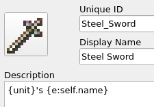
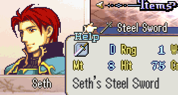

# Text Formatting Commands

_written by rainlash_
_last updated 2024-11-13_

## Dialogue Formatting Commands

In order to have your in-game dialog between characters or between the narrator and the player flow well and be more interesting to read, you can use several special dialog commands.

`{w}, {wait}`: Waits for the user to press A. Automatically placed at the end of any speak command unless text ends with {no_wait}.

`{no_wait}`: Place at the end of a dialog and the dialog will not wait for the user to press A.

`{br}, {break}`: Line break.

`{clear}`: Clear the text and line break.

`|`: shorthand for `{w}{br}` in sequence.

`{semicolon}`: Adds a `;`

`{tgs}`: Toggles whether the speaking sound occurs.

`{tgm}`: Toggles whether the portrait's mouth will move while talking.

`{max_speed}`: After this command, dialog will be drawn immediately to the screen.

`{starting_speed}`: After this command, dialog will be drawn at the normal speed to the screen.

`{command:??}, {c:??}`: Allows you to run any event command inline while dialog is being drawn to the screen. For instance: `s;Eirika;I'm... so.... {c:set_expression;Eirika;CloseEyes} sleepy...`

## General Formatting Commands

The below formatting can be used in both dialogue and most description boxes for units/items/skills/etc.

`<red>`: Can be used to turn the font to red color. Turn back to normal with `</red>` or `</>`. Can also use `<blue>`, `<green>`, etc.

`<icon>??</>`: Paste any 16x16 icon with a name directly into the text. For instance, `<icon>Waffle</>`.

`<text>`: Can be used to change the font. Turn back to normal with `</text>` or `</>`. Can also use `<nconvo>`, `<narrow>`, `<iconvo>`, `<bconvo>`, etc.

`<wave>`: Can be used to change the text effect. Turn back to normal with `</wave>` or `</>`. Can also use `<wave2>`, `<sin>`, `<jitter>`, `<jitter2>`, etc.
Advanced usage: some text effects may have arguments that can be used to customize the effect. For example, wave has a `amplitude` argument that can be used to customize the amplitude of vertical wave oscillation.
The exact usage would look like `<wave amplitude=4.5>some text</>`. The general format for effect arguments is `<effect arg1=val1 arg2=val2 ...>`. Parsing for arguments is whitespace and case sensitive.
For a full effect list look at `app/engine/graphics/text/text_effects.py`. Both `TextEffect` and `CoordinatedTextEffect` classes are available to use as text effects in dialog, and the corresponding names for each effect is under the effect class as its `nid` and the available arguments for each effect is the arguments to its `__init__` function excluding `self` and `idx` arguments.

## Evaluated Descriptions

### What Are They

Some descriptions in the editor allow you to use evaluated text. These are things like `{v:}` and `{e:}`.

Specifically at the moment this includes:

1. Unit descriptions
2. Item descriptions and skill descriptions

### Evaluated Variables

The evaluated text for the statements above all have access to a few common variables.

Like all evaluated statements evaluated text has access to a variable called `game`. This is the variable for the game state.

All descriptions also have access to a variable called `self`. This refers to the variable in the engine code that represents the object that the description belongs to. For example, the `self` variable for a unit description refers to a unit object in the engine code. Likewise for items and skills.

Items and skill descriptions have access to an additional variable called `unit`. This variable refers to the unit that currently owns this item or skill. This is equivalent to the statement `{e:game.get_unit(self.owner_nid)}` and is just a convenience variable.

### Examples

#### Item Ownership

This is a simple concrete example. We can add a description for who's item it is in the item description. For example if Seth is holding a Steel Sword, we can modify the description of a Steel Sword to be `{unit}'s {e:self.name}`

This will be evaluated and displayed as `Seth's Steel Sword`.

#### Dynamic Gender and Pronouns

If we wanted to add dynamic gender we can use this feature. For example if we wanted dynamic gender for a certain unit, we can set a persistent variable during unit creation and use it in the description.

`"A wild {e:"man" if "{v:WildPronoun}" == "He" else "woman" if "{v:WildPronoun}" == "She" else "person"} raised in the forests of Nabu. Has a fear of blood and hates spiders."`

Lets say `WildPronoun` was set to `"He"` then the entire description would evaluate to: `A wild man raised in the forests of Nabu. Has a fear of blood and hates spiders.`

#### Kill Tracker

We can add a kill tracker to an item or skill using this feature. We can set a persistent variable tracking the number of kills a unique weapon has been used for and show it in the description.

`"A blade that has taken {v:UniqueWeaponKills} lives."`

Lets say `UniqueWeaponKills` has tracked 10 kills so fa, then this description would evaluate to: `A blade that has taken 10 lives.`

### Advanced Usage

Since `self` refers to the object that the description belongs to, you have access to all variables accessible from that object. You can use that knowledge however you like.
