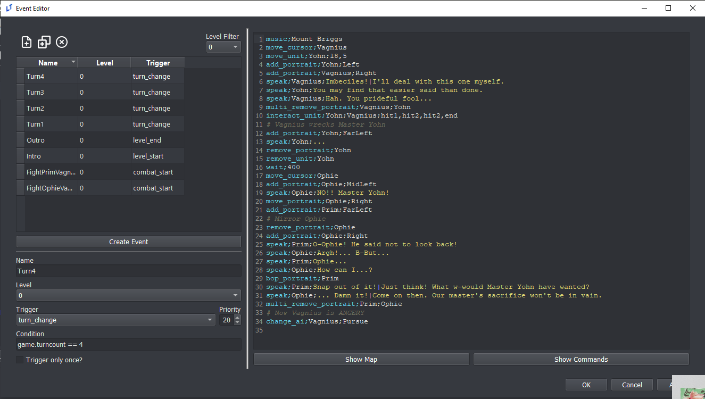
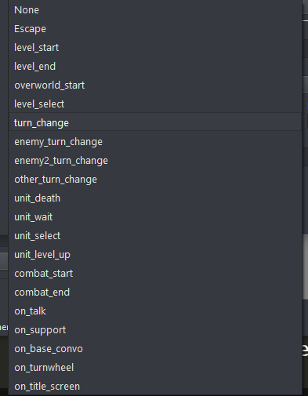
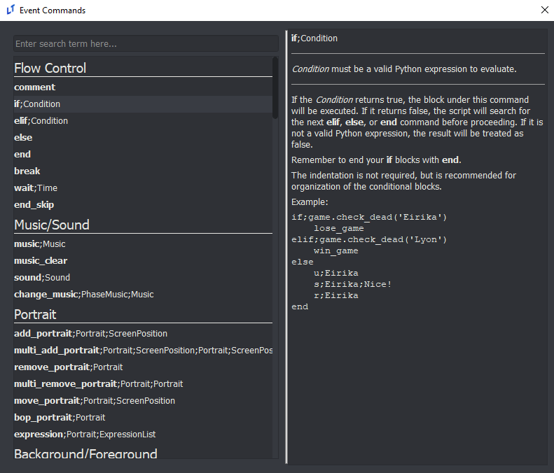

(EventOverview)=
# Event Overview

_last updated v0.1_

Events are a powerful tool for any game designer, allowing you to implement unique dialogue, cutscenes, and action in your game.

An event consists of four things:



1. A unique **name** so that it can be uniquely identified in the engine
2. A **trigger** that causes the event to activate
3. A **condition** that is checked by the event when it triggers
4. A list of event **commands** to run

Once a trigger has been fired by the engine, all events that subscribe to that trigger are activated. The event's condition is checked, and if true, that event will occur. The event will run through it's list of event commands in order until complete, and the engine will then return to its normal processing.

## Triggers

There are several default triggers that will fire when a certain state is reached in the engine. The events you create can catch these triggers and activate when appropriate.

Event Regions can create their own triggers which can also be caught by the event system. See [Region Events](Region-Events) for more information.

## Format

`trigger_name` {`extra available inputs`}: Description and potential use case.

## Trigger List



1. `level_start`: This trigger fires at the very beginning of the chapter. Useful for introductory dialogue or additional level setup.

2. `level_end`: This trigger fires at the end of the chapter. Useful for ending chapter dialogue.

3. `turn_change`: This triggers fires right before the turn changes to the player's turn. Useful for dialogue or reinforcements.

4. `enemy_turn_change`: This trigger fires right before the turn changes to the enemy team's turn. Useful for "same turn reinforcements" and other evil deeds.

5. `enemy2_turn_change`: This trigger fires right before the turn changes to the enemy2 team's turn.

6. `other_turn_change`: This trigger fires right before the turn changes to the other team's turn.

7. `unit_death` {`unit`, `position`}: This trigger fires whenever *any* unit dies (this includes generic units). Useful for death quotes.

8. `unit_wait` {`unit`, `position`}: This trigger fires whenever a unit waits.

9. `unit_select` {`unit`, `position`}: This trigger fires when the player selects a unit.

10. `unit_level_up` {`unit`}: This trigger fires right after a unit levels up.

11. `during_unit_level_up` {`unit`, `unit2`}: This trigger fires when the unit levels up, right after the level up screen shows what stats have increased.

12. `combat_start` {`unit`, `unit2`, `item`, `position`}: This trigger fires at the beginning of combat. Useful for boss fight quotes.

13. `combat_end` {`unit`, `unit2`, `item`, `position`}: This trigger fires at the end of combat. Useful for checking win or loss conditions.

14. `on_talk` {`unit`, `unit2`, `position`}: This trigger fires when two units "Talk" to one another.

15. `on_support` {`unit`, `unit2`, `item`, `position`}: This trigger fires when two units "Support" with one another. For this trigger, `item` contains the nid of the support rank ('C', 'B', 'A', or 'S', for example).

16. `on_base_convo` {`unit`}: This trigger fires when the player selects a base conversation to view. For this trigger, `unit` contains the title of the base conversation.

17. `on_turnwheel`: This trigger fires after the turnwheel is used.

## Conditions

Imagine you want an event to trigger when a specific unit dies. As stated above, the `on_unit_death` trigger will fire whenever **any** unit dies. So, if you create an event that triggers on unit death, by default it will trigger on all deaths, including enemy generics.

Setting a Condition allows you to limit the event to activate to only when the Condition is true.


The `on_unit_death` trigger supplys the unit that died under the name `unit`. So we can simply enter `unit.nid == 'Eirika'` in the Condition box for our event. Now, if the unit that died had an nid of `Eirika`, the event will activate. Otherwise, the event will be ignored.

More information on what can be checked within a condition can be found here: [Conditionals](Conditionals)

(EventCommands)=
## Event Commands

Event commands are written by you, the game designer, in order to accomplish your goal for an event. For instance, if you want Eirika to appear and say `Oh no!` when she dies, you could setup a `on_unit_death` event with the condition `unit.nid == 'Eirika'` and the text:

```
add_portrait;Eirika;Right
speak;Eirika;Oh no!
remove_portrait;Eirika
```

There are many event commands available, and it is not expected that you will remember them all off the top of your head. A searchable index of event commands is available within the event editor.



Feel free to check out the events that already exist in the default project or the Lion Throne project. They can and should be used freely as reference.

Also, [Miscellaneous Events](Miscellaneous-Events) contains additional information on how to set up certain kinds of events.