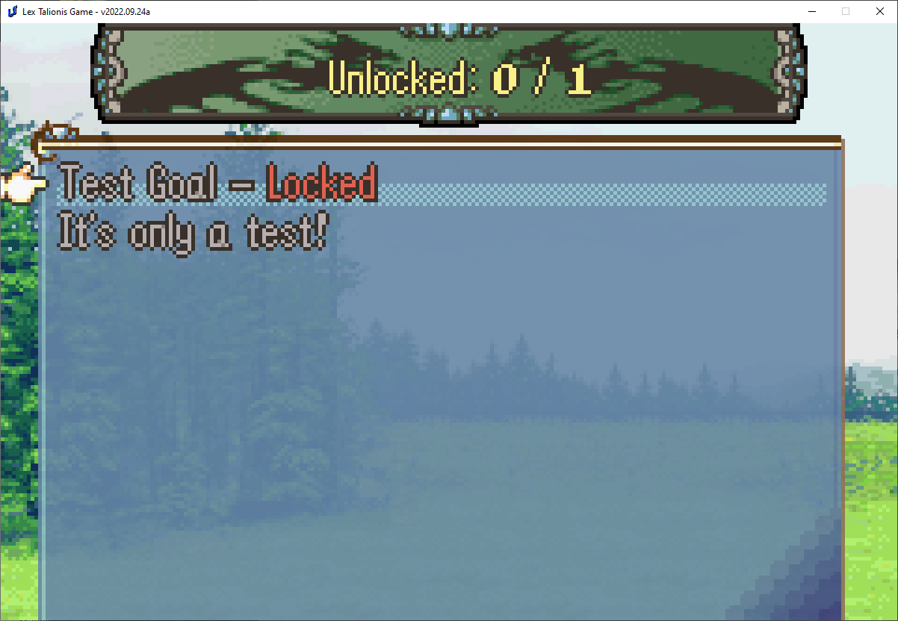
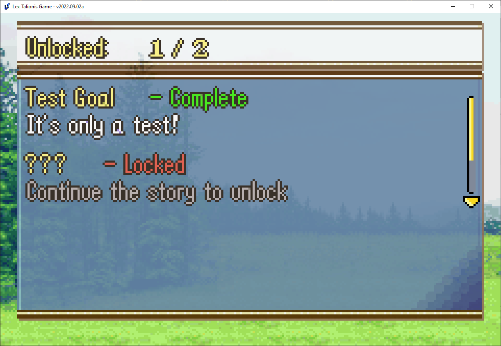
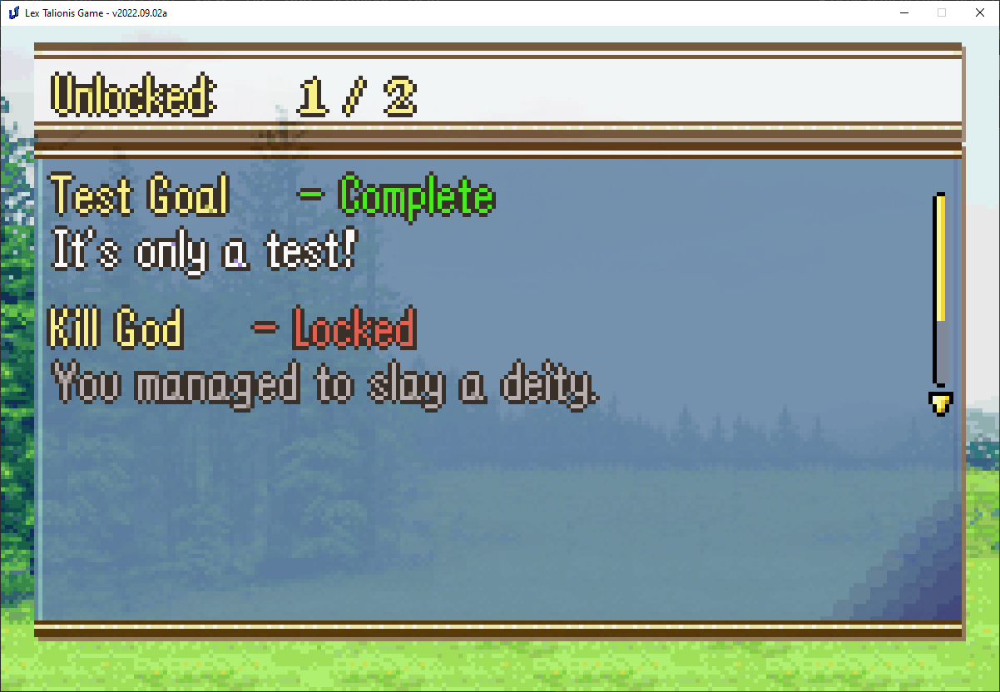

# Achievements

You may wish to create an achievement system for your game. Alternatively, you may simply want to save content outside of a given save file. This could be for a New Game+ feature, an Undertale-like playthrough system, or timeline shenanigans. This guide will cover all of these potential use cases.

## Basic Functionality

The create_achievement command creates a new achievement with the given specifications and saves it to saves/PROJECTID-achievements.p.

```create_achievement;Sample;Test Goal;It's only a test!```

Try it out by putting this line before a base event command in any given level. Test the level and go to Codex > Achievements.



Voila! You have an incomplete achievement listed there. Of course, we'd like to have the player be able to complete that achievement.

In any event you'd like, place this command:

```complete_achievement;Sample;1```

Where Sample is the NID of the achievement you created above. Run that event then check the records screen again - the achievement will be complete!

## Secret Achievements

Many games have achievements for defeating endgame bosses. In order to avoid spoilers for those bosses, we'd like to hide some achievement information from the player.

The first option we have is to only run the create_achievement command when the boss is first defeated. That way the achievement won't appear in the Records menu early, since it won't exist.

Most game platforms, like Steam, display certain achievements as "Locked" prior to their completion. Let's implement a system for our game.

Create a new achievement.

```create_achievement;KillGodOrSomething;???;Continue the story to unlock;hidden```



Players can see that they haven't unlocked all achievements, but will naturally later on. We can use the update_achievement command to change the details of the displayed achievement.

```update_achievement;KillGodOrSomething;Kill God;You managed to slay a deity.```



The details of the achievement have been updated.

## Player record storage

I'd like to remember if the player has completed the game. I can't keep that data tied to a particular save file, so the persistent record system is perfect here.

Similarly to achievements, we'll create a new record first.

```create_record;CompleteGame;False```

When you create or update a new record, remember that you must provide it a valid Python expression after the name. It is therefore recommended that you provide one of True, False, or a number unless you are confident you know what you're doing.

Similar to achievements, you can use update_record or replace_record to change the value later. You can also check the value of records, as seen below.

```
if;RECORDS.get("CompleteGame")
    speak;Eirika;I've won before
else
    speak;Eirika;I haven't won yet.
end
```