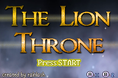
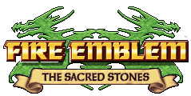
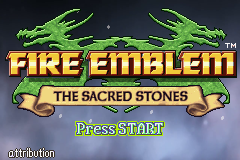
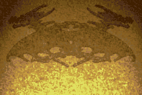

# Title Screen

In this section, we will change the default _The Lion Throne_ title screen to the one used by the _The Sacred Stones_. Once you understand how to do that, changing the title menu to use your own custom images should be easy.

There are four main components to the title screen that you can change.

1. Logo
2. Press Start Icon
3. Background
4. Attribution

## Logo

Download the new Sacred Stones logo:

To do these changes, we will have to delve into your project's **resources/custom_sprites** directory. If a **custom_sprites** directory does not already exist for your project, create one (make sure it's named exactly **custom_sprites**). Then, put the Sacred Stones logo PNG file into that directory with the exact name **logo.png**.

## Press Start

This works similarly. If you have a new Press Start animation you want to show, you can add the PNG file to the **custom_sprites** directory in your project's **resources**. Make sure it's named exactly **press_start.png**.

## Background

Switching out the background is also a simple affair. Open up the Panoramas editor and locate the **title_background** panorama. Delete it. Now you can import your own background. It can be a static background like Sacred Stones uses, or you can import several png files at the same time as long as they have numbers at the end of their filenames (like **title_background0.png**, **title_background1.png**, etc.)

## Attribution

On the bottom left hand corner of the title screen is the attribution. You can change what it says in the Translations editor. Find the key `_attribution` and change the value to whatever you'd like the title screen to say, such as `created by you`. If the key does not exist in the translations editor, create a new Translation with the key first.

## Complete!
Now you can pull up the game and check out the new and improved title screen!

