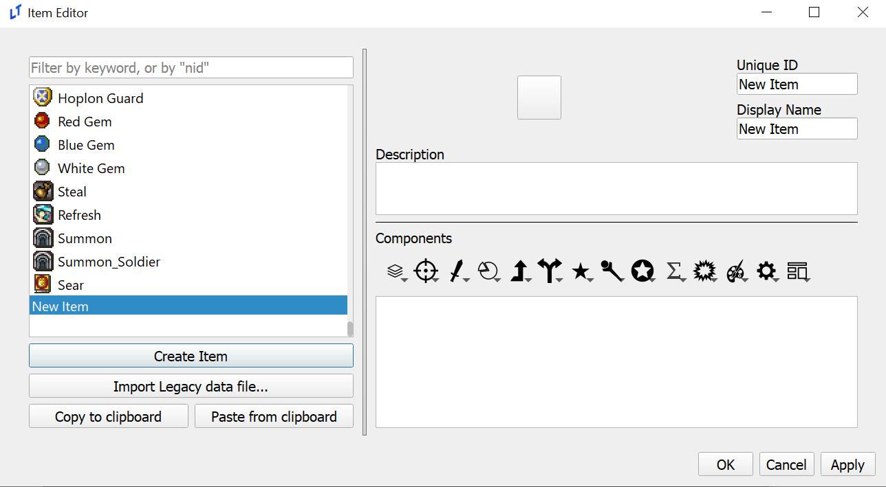
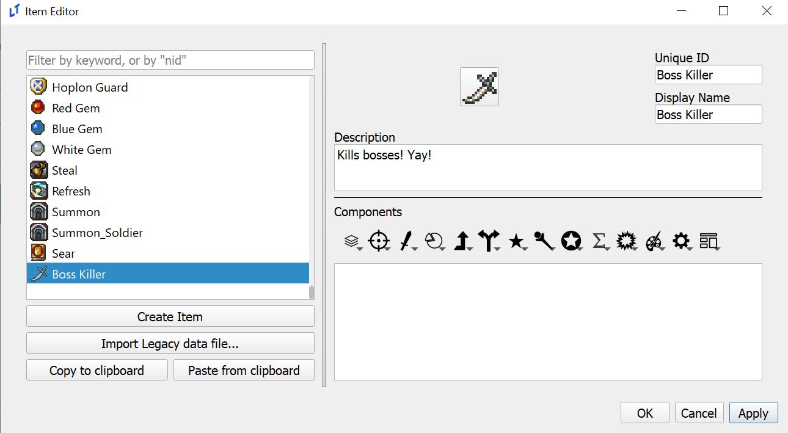
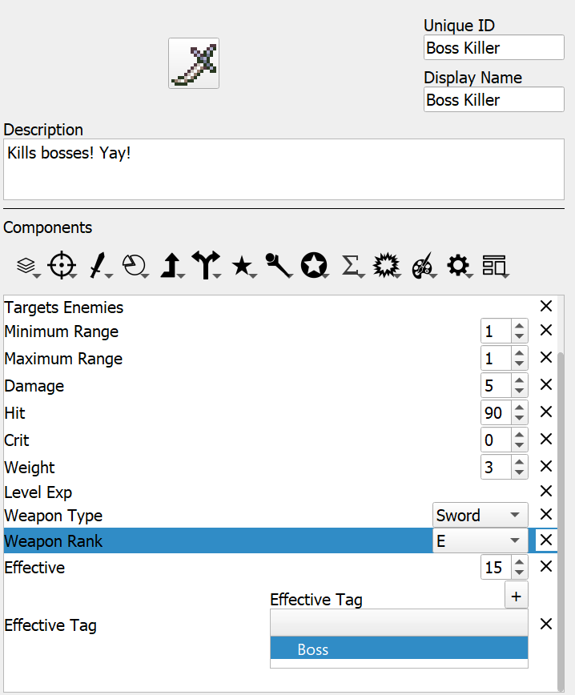
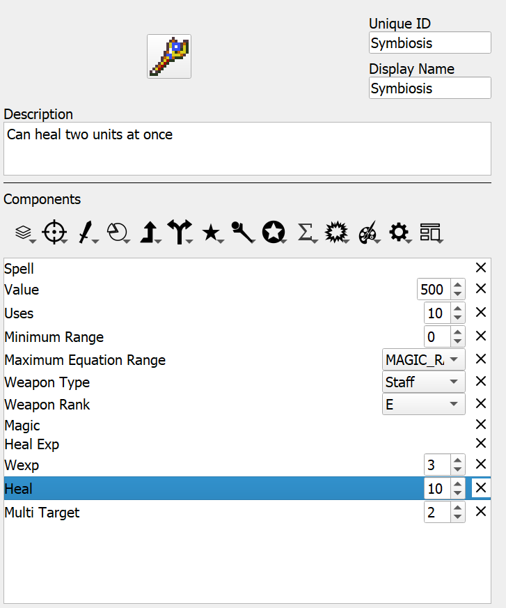
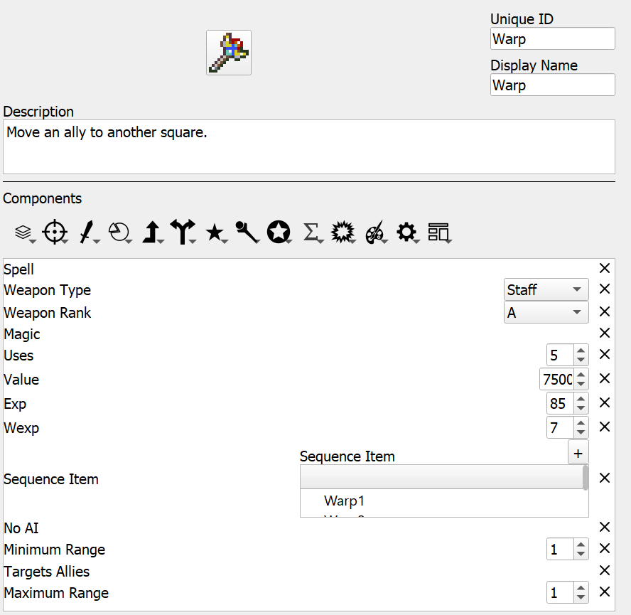
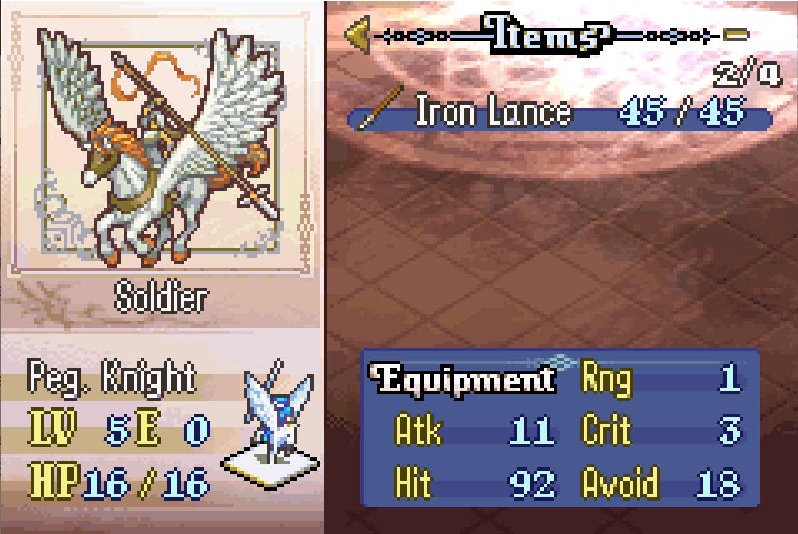

# 0. Creating Items

The item and skill editor are some of the most expansive parts of Lex Talionis. However, due to the wide array of options they can often be daunting to new users.

This guide will create five example items that will hopefully provide helpful examples on how some of the more exotic components can be used.

Before you continue reading, scroll through the items already included in the Sacred Stones project. Many desired items already exist either there or in the Lion Throne.

## Item 1 - Boss Killer Sword

We'll start with a simple tool to help you kill your boss.

From the item editor, click the "Create Item" button. A new item will be created.

We'll start from the top right and work our way down. First, fill out the sword's unique ID slot. You'll notice that whatever you type in unique ID is copied into the name, but not vice versa. The unique ID acts as the weapon's "true name". When referring to an item or skill in events you'll want to make sure that you're calling it's ID, rather than it's name.

To the left of those two text boxes is a while square. Click on it to bring up the icon selector. Depending on if you've used the icon selector previously, you might not have any icons to choose from. If that is the case, click "Add New Icon Sheet" and add the following image. You can find more like this in the default or sacred_stones resource/icons16 folder.

Choose an icon you like and hit okay. Once the window closes, type a description in the box below.

Your item should now look something like this:

Click "Apply" in the bottom right. In Lex Talionis, apply equivalent to the save button. Always make sure that you apply changes before you close an editor!

From now on, each item and skill covered in tutorials will assume that you've done the previous steps.

This list of item components is the essential elements of every item in the game. Each of these icons has a number of components contained within. Before you get too daunted, click the icon on the far right and choose "Weapon Template". The templates will be a helpful guide to the items we'll make in this tutorial.

Choosing weapon template will apply a number of self-explanatory components to the weapon. If you're confused about any of them, hover over the component. A short text box will appear explaining what it does. Set whatever values you want for the new components.

Now click on the start icon in the middle. At the top of the list, choose the "Effective" Component. If you scroll down using the sidebar, you should see that two new components have been added.

The Effective component decides what the might of the weapon becomes when it is effective against a target. It is **not a multiplier**, it is an addition. I will set mine to 15 - for a total of 5 + 15 base might against an effective target.

Now go to Effective Tag. These determine the tags which this weapon is effective against. The plus in the top right adds a tag to the list. Double click on the newly created tag and choose "Boss" in the popup menu. If you would like, you can press the plus again to add more tags. Further tags can be created in the tag editor and assigned to classes in the class editor. For now, my final item looks like this (weapon and value components are cut off at the top):

## Item 2 - Multi-unit Healing Staff

In Absolution, ZessDynamite's Lex Talionis project, he has a staff called Symbiosis that can heal two units at once. We'll create something similar. First, set up the name, icon, and description of the staff, similar to the last item.

Now, go to the template icon and choose "Spell Template". Change the weapon type to Staff. By default, minimum range is 0. That allows the unit to heal themselves with the staff. Change it if you wish.

However, delete the maximum range component. Click the reticle icon and choose "Maximum Equation Range". While Maximum Range is a fixed integer, maximum equation range can refer to an equation defined in the equations editor. If you're working off the sacred stones project I would set MAGIC_RANGE as the equation to refer to. If not, you can either make your own equation or choose another one.

Clicking the reticle again, choose "Target Allies". The pie icon contains "Uses" and "Chapter Uses". Uses acts like normal Fire Emblem uses, while chapter uses refresh at the end of the chapter. Choose what you'd prefer and set it to the value you desire.

The single up arrow icon contains exp components. Heal EXP makes sense here, as well as WEXP for that glorious staff rank. These components would normally be included in a weapon template, but the spell template is a bit broader.

Finally, click the staff icon and choose between "Heal" and "Magic Heal".  Heal only ever heals the amount specified in the item, while magic heal heals the amount specified plus the value of a HEAL equation in the equations editor.

Finally, click the gear icon on the far right and choose "Multi Target". This will finish your item. Go ahead and test it!

## Item 3 - The Warp Staff

The Sacred Stones project already has a warp staff implemented, so instead of creating our own I'll be explaining how sequence item (the component that makes warp staves possible) works.

Compared to what we saw with the Symbiosis staff there are two new components here. The first, and simplest, is "No AI". The AI in Lex Talionis currently cannot handle sequence items. As such, any item with the sequence item component must either be given the no AI component or kept away from the AI. 

The sequence item component is the core of the warp and rescue staves. Sequence item refers to a certain amount of sub-items that exist when the main item is used. In warp's case, Warp1 is the first sub-item that is called. It's a simple item overall, but contains the "Store Unit" component. This component simply has the game remember the unit that this item selects. Once Warp1 is used Warp2 is called. Notice that Warp2 targets all tiles, rather than Warp1's allies, and has the "Unload Unit" command, which places the unit on the selected tile.

Hopefully, this sheds a bit of light on how sequence items work and why they're important. If you have an item that does two different things sequence items can be a useful way to implement them. If you're looking for more examples, the Rescue staff is a good reference.

## Item 4 - Iron Shield

Shadows of Valentia used non-weapon accessories as an additional way of augmenting units. This can be done in the Lex Talionis engine through accessories.

First, open the constants editor. On the left you should see a box labeled "Max number of Accessories in inventory". Increase that number to at least one. Hit apply, then ok.

Set up the description and name. Then, choose the farthest left icon and  select the "Accessory" component. Click the star component and choose "Status on Hold". The list next to this component shows a list of all skills in your project. The Sacred Stones project has Defense +5 as a base skill, so we'll use that. Give it to a unit, and test it out! You should notice a nice +5 next to your unit's defense.

However, if you scroll to the unit's inventory, you might notice something weird. The Iron Shield doesn't seem to be there!

The unit UI currently only has space to display five items. Remember how we increased accessory number to one? That means that the Iron Shield is currently taking up the sixth item slot. Reducing the max number of weapons in a unit's inventory fixes this issue.

## Item 5 - Three Houses Magic System

Three Houses took a rather unique approach to its magic system. Rather than having tomes that share inventory with other weapons, 3H tomes recharged at the end of each chapter and had a separate inventory space. While we can't delineate an *entirely* new space for tomes, we can get pretty close through the power of the Multi Item component.

As always, create a new item with a name, description, and icon. Click the gear icon and choose "Multi Item". This will add a component with a space similar to the sequence item or effective tag components. You can add previously made weapons, like fire or thunder, to be included in this multi item.

And... that's it! If you really want to go full Three Houses, replace the uses component in the tomes you added with the chapter uses component. The add_item_to_multiitem event command can be a useful way to add spells to an individual unit's multi item, allowing you to make completely unique spellcasters! For more information, check out the documentation on the command in the event editor.

## Conclusion

Hopefully this has given you a basic overview of what you can do with Lex Talionis' item components. A following post will detail each component in detail, and the discord server as well as other LT projects are great resources to turn to for more information.