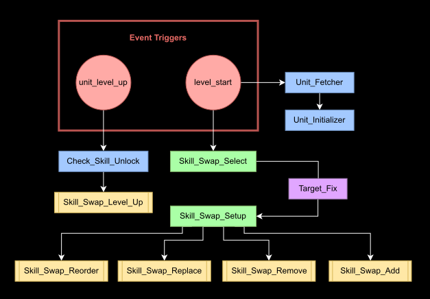
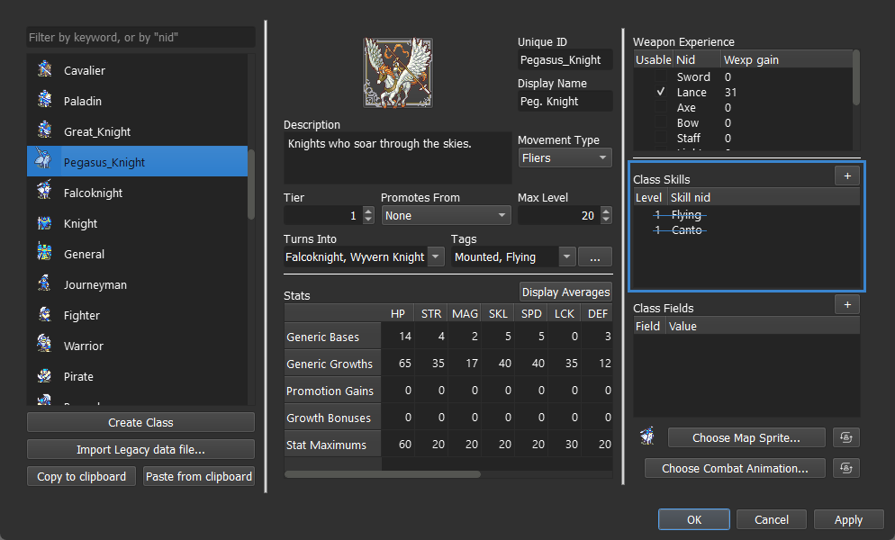
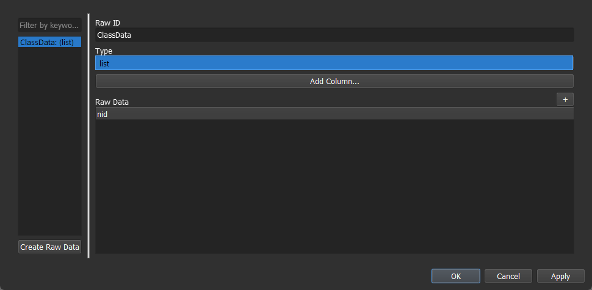
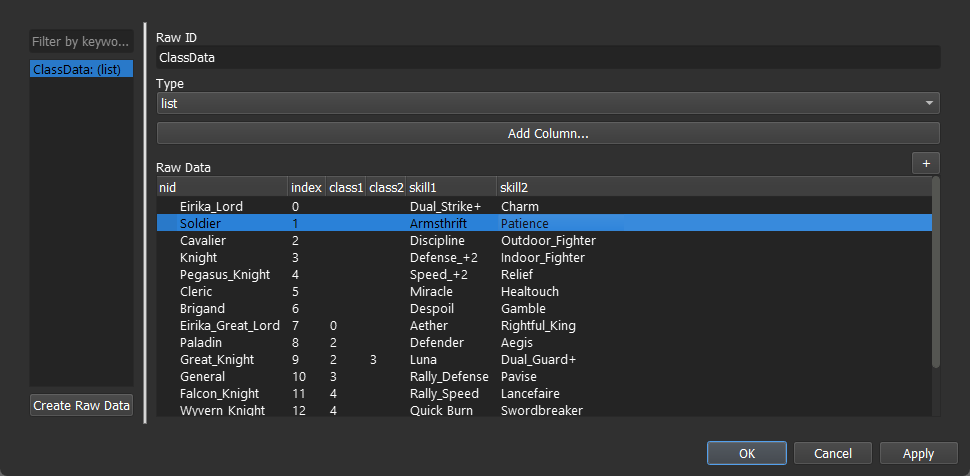
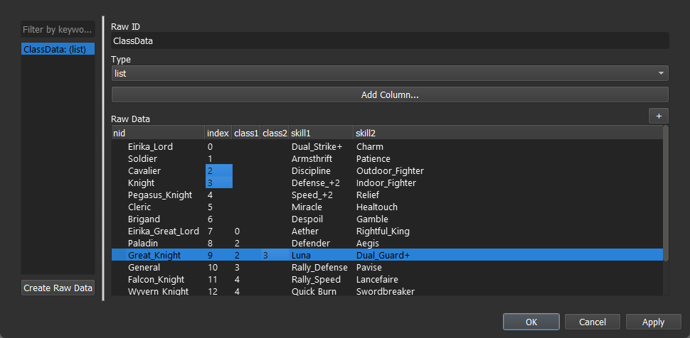
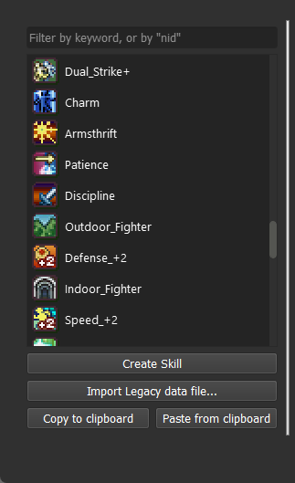
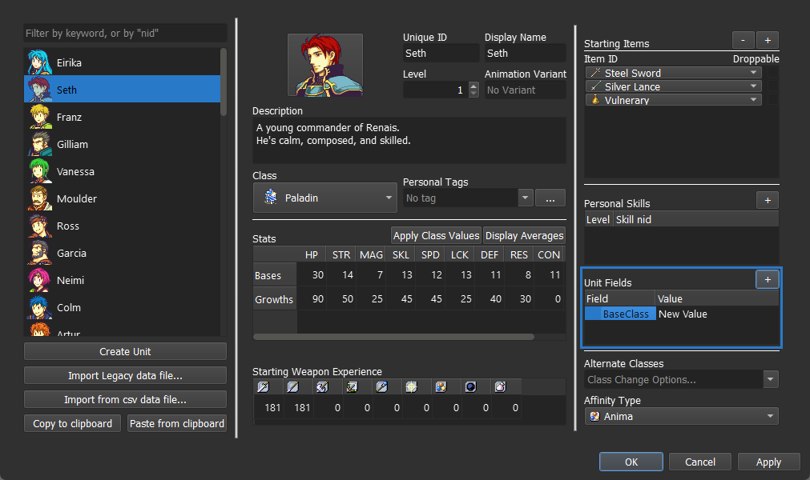
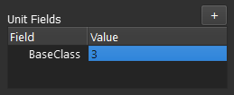
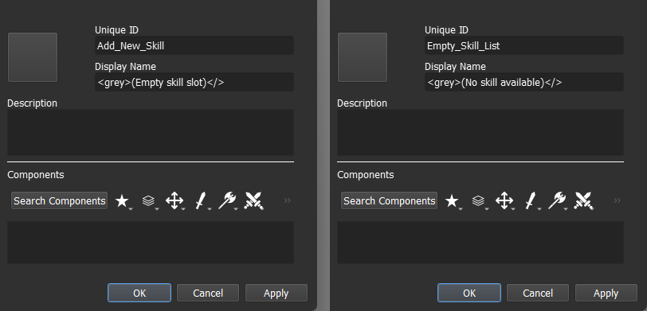

<small>`Originally written by Hillgarm. Last Updated 2022-09-01`</small>

# [System] Skill Swap
Lex Talionis Event Editor offers enough power to build custom systems. They can be quite complex, and this is the case with skill swap.

In this guide, we will be covering all the requirements to build your own skill swap system using the tools available in the latest engine build.

It is expected for the reader to have prior experience in the editors and components used, as most of them will be glossed over due the amount of steps required. Check the documentation and other guides to get learn about these components.

We will be building the pieces in order of functionality, which may lead to a few back and forward.

You will be able to get the code at the end of every major step, mostly ready to use. It's still recommended to go over every single step in order to understand the mechanisms and how to adjust them to individual project demands.

**Index**

* **Required editors and components**
* **Understanding the problem**
* **Events and Variables**
* **Step 0: Understanding how to build tuple with strings**
* **Step 1: Remove all skills from classes and units**
* **Step 2: Set the Raw Data table**
* **Step 3: Build an Initializer event**
	* Step 3.1: Create a level start manager
	* Step 3.2: Set the initialization condition
	* Step 3.3: Retrieve the current class Index value
	* Step 3.4:  Retrieve the current class data
		* Step 3.4.1: Add self contained class exceptions
	* Step 3.5:  Retrieve the previous class data
	* Step 3.6: Set both skill tuples
	* Step 3.7: Assign the equipped skills
	* **Complete script**
	* Step 3.7+: Add more learned skills
* **Step 4: Build the skill unlock event**
	* Step 4.1: Find the ClassData corresponding index
	* Step 4.2: Retrieve the skill based on the unit level
		* Step 4.2.1: Add self contained class exceptions
	* Step 4.3: Add the skill to the LearnedSkill tuple
	* Step 4.4: Auto equip the new skill
	* **Complete script**
* **Step 5: Create the Skill Swap base**
	* Step 5.1: Create Slot skills
	* Step 5.2: Process the equipped skills group
	* Step 5.3: Build the equipped skills menu
	* Step 5.4: Add a refresh mechanism
	* **Complete script**
* **Step 6: Add skill swap as a menu option**
* **Step 7: Build the Skill Swap Operations event**
	* **Complete script**
* **Step 8: Build the operations**
	* Step 8.A: Remove
	* Step 8.B: Reorder
	* Step 8.C: Add
	* Step 8.D: Replace
	* Step 8.E: Replace on level up
* **Step 9: Test the system**

## Required editors and components
* Event:
	* Commands - game_var, set_unit_field, give_skill, remove_skill, trigger_script, for, if, table, choice
* Skills
* Raw Data
* Objects, Attributes and Methods:
	* unit - klass, get_field('{field}'),
	* game - get_data('{raw data}')

## Understanding the problem
Skill swap is a really simple concept but it takes a couple of minor systems to work. We will use the standards set in Fire Emblem: Awakening for this guide.

A way to describe skill swap is the follow:

	A system that grant units new individual skills by
	leveling up based on their current class, providing
	a wider array of options and personal customization
	for each unique class the unit ventures in, only
	limited by a maximum amount of simultaneously
	equipped skills.

Here are the basic directions:
* **[SLOTS]** Each unit can have up to a certain amount of skills, 5 in this instance.
* **[POLL]** Every unit has its own individual collection of skills to pick from.
* **[INHERIT]** Units have to own all the skills corresponding to their current class level and promotion path.
* **[UNLOCK]** Skills are unlocked by leveling up
* **[ASSIGN]** Skills are automatically equipped if a slot is available when the unit is introduced or when it learns a new skill.
* **[MANAGEMENT]** The player can add, remove or swap skills at will.

These 6 points are the foundation of the system, and will have address them from scratch. On a technical side, **Management** and **Slots** can't work with the native skill assignment system, so we will have to built a new one as well.

In addition, the **Management** element also has 4 smaller components.
* **[ADD]** Equip a learned skills
* **[REMOVE]** Unequip a skill
* **[SWAP]** Replace an equipped skill with an unequipped one
* **[REORDER]** Move an equipped skill to the first slot.

Those operations require items to be added and removed from our **poll**, and will give us two options.

1. Make the equipped skills poll a completely different set from the learned skills poll. Operations will move items from one poll to the other.
2. Make the equipped skills poll an assortment of the items from the learned skills poll. Operations will change the items within the equipped skills poll, but not the learned skills poll.

Here's a visual example

||Equipped skills|Learned skills|All skills|
|-|-|-|-
|**Option 1**|Sol, Luna|Axefaire|Sol, Luna, Axefaire
|**Option 2**|Sol, Luna|`Sol`, `Luna`, Axefaire|Sol, Luna, Axefaire

In a strict sense, option 1 is the most accurate. The only issue with it is that if we fail to properly handle any addition or removal operation, we may end up with duplicated skills or even delete it completely.

We will stick to the second one as it is easier to handle, less prone to bugs and also allows some extra customization options such as forced pair skills (it is a possibility but won't be covered in this guide).

As such, the equipped skill poll will be a slice of the learned skill poll, and we will filter those skills out whenever we need to.

## Events and Variables
For this guide we will have a total of 12 events. One of them being solely used as a conversion tool. It is possible to reduce them by half but that can make things significantly more confusing. Our events will have an underscore between words.

To save time, create all of the listed events in advance, preferably using the same names, as those will be the ones listed in the guide. Don't forget to set their triggers as well. Those who have events listed as triggers have to be set as **None**. All of them use the Global level.

|Event|Type|Trigger
|-|-|-
|`Unit_Fetcher`|Collector|level_start
|`Unit_Initializer`|Assignment|`Unit_Fetcher`
|`Check_Skill_Unlock`|Assignment|unit_level_up
|`Target_Fix`|Conversion|`Skill_Swap_Select`
|`Skill_Swap_Select`|Interface|`base;` or `prep;` commands
|`Skill_Swap_Setup`|Interface|`Target_Fix`
|`Skill_Swap_Operations`|Interface|`Skill_Swap_Setup`
|`Skill_Swap_Add`, `Skill_Swap_Remove`, `Skill_Swap_Reorder`, `Skill_Swap_Replace`|Option|`Skill_Swap_Operations`
|`Skill_Swap_Level_Up`|Option|`Check_Skill_Unlock`

Here's a simple flowchart on how they will be connected.

As for our variables, most of them will be temporary data managers, and all of them are mandatory.  All of our variables names will be written in upper case and have an underscore between words.

|Variable|Type|Role
|-|-|-
|*`_SKILLS`|String/Tuple|Holds all the skills `EQUIPPED`/`LEARNED` by a given unit
|`AUX_`*|Boolean, Integer, String, Nid|Temporary variable of a given type.
|`C_INDEX`|Integer|Same as `AUX_INT`, but only used to retrieve indexes.
|`FECHED_`*|Nid|Contains the Nid of the current `UNIT`/`CLASS`/`SKILL` in a loop.
|`EXIT_SKILL_SWAP`|Boolean|Allows skill swap to be refreshed or terminated.
|`UNIT_EQUIPPED_SKILLS`|Nid|Selected skill from the list of equipped skills, that will undergo a skill swap operation.
|`UNIT_LEARNED_SKILLS`|Nid|Selected skill from the list of learned skills, that will undergo either add or swap/replace operations.
|`EQUIP_NEW_SKILL`|String|Yes/No option to swap an equipped skill with the last skill obtained when no equippable slot is available.
|`SKILL_SWAP_CAP` (Optional)|Integer|Defines the maximum number of equippable skill slots.
|`SELECTED_UNIT`|nid|Unit selected for skill swap.

Our field list will be significantly shorter. They won't use underscore and will start with a capital letter for each word split.

|Field|Assign on Editor|Role
|--|--|--
|`Initialized`|No|Checks if the unit went through initialization
|`BaseClass`|Yes|Contains the corresponding index of the base class. Exclusive to pre-promoted units.
|`LearnedSkills`|No|Tuple containing all the skills learned by the unit.
|`EquippedSkills`|No|Tuple containing all the currently equipped skills by the unit.

## Step 0: Understanding how to build tuple with strings
Before we get into the guide itself, there's a simple concept we need to understand as it will be a core aspect of our systems. Tuples are a type of array, which is a kind of variable that works as a item list. Instead of having a single value, it holds multiple entries that carry their individual values in itself, which is what exactly has slots work.

The event editor allows us to create tuples and retrieve tuple data but doesn't allow us to use any of the tuple related operations directly. As such, we're forced into converting them depending on what kind of operation we need to perform. We'll build them from strings, convert them to tuple then later conver it strings, perform an operation through strings, and convert it back to tuple.

Out of all the operations we will perform, adding a new entry is the most essential. To do it through strings, we need to stack our elements in a single auxiliary string while respecting the tuple building syntax, like adding extra carts to a train.

	game_var;EXAMPLE;""
	game_var;EXAMPLE;"'First item',"
	game_var;EXAMPLE;"{v:EXAMPLE}" + "'Second item,'"
	game_var;EXAMPLE;"{v:EXAMPLE}" + "'Third item,'"

We will have to wipe our string before every stacking process to prevent leftover data and, in some cases, set it to a specific value that will be forced as the first item as well.

In this example, our string value should be:

	'First item','Second Item','Third item',

It can then be converted into a tuple, by calling itself in brackets.

	game_var;EXAMPLE;[{v:EXAMPLE}]

Every non-numeric item in it has to be contained in a pair of apostrophes followed by a comma. Otherwise it will interpret the commas as part a valid text element.

* *A tuple containing `'A','B','C'` has 3 elements - [A], [B] and [C]*
* *A tuple containing `'A,B','C'` has 2 elements - [A, B] and [C]*

## Step 1: Remove all skills from classes and units

As said before, the base system won't work with the level of control that we want. In order to use a custom assignment system we need to wipe out all of the skills from the base system.

It is recommended to remove all of the skills, including Flying and Canto, if you plan to have class change and class promotion in your project.

## Step 2: Set the Raw Data table

The first step to create or new skill assignment system is to build a replacement for the data we deleted. We can do that by building a **raw data** list, named `ClassData`.

Our table will use the following columns.
||nid|class1|class2|skill1|skill2
|-|-|-|-|-|-
|**data**|-|-|previous class A|previous class B|1st skill unlocked|2nd skill unlocked
|**type**|class unique ID|int|int or *blank*|skill nid|skill nid

For this guide, we will also add an index (starting at 0) column to make it easier to read and assign class codes. You can add more columns to fit your project needs, such as class3, skill4, etc.

Next, we need to fill the table with the data. Both **class fields** will be exclusively used by advanced classes, filling each with the base class it promotes from. If a class only has one promotion option, fill the `class1` **field** and leave the other one empty.

Here's a quick example.

|index|nid|class1|class2|skill1|skill2|
|-|-|-|-|-|-
|0|Lord|||DualStrike+|Charm
|1|Cavalier|||Discipline|OutdoorFighter
|2|Knight|||Defense+2|UbdoorFighter
|3|GreatLord|0||Aether|RightfulKing
|4|GreatKnight|1|2|Luna|DualGuard+
|5|General|2||RallyDefense|Pavise

The end result should look similar to this:

<small>*This is a simplified table for the units that will be used in the guide, with many skills and classes being replaced by similar. You will run into errors if any data in it is missing or incorrect. Be sure to check and test all of it once the system is complete.*</small>

Just to reinforce an important point. Both `class1` and `class2` must contain only numerical values, as those are indexes that reference other classes in our table. For **Eirika_Great_Lord**, only `class1` is used, and has the value 0 assigned, which is **Eirika_Lord's** index. Meanwhile, **Great_Knight** has two possible classes to be promoted from, and 2 and 3 correspond to **Cavalier** and **Knight** respectively.

Skills also have to be assigned with proper nid's, as shown in the image below.

This base concept can also be used to assign unit exclusive and/or secret skills, though the specifics won't be covered in this guide.

## Step 3: Build an Initializer event

Next. we will assign skills to our units. This is an issue on its own as it has to be applied to both allies, enemies and neutral units when they first appear in the game.

To do so, we will have to run an event that assign skills to our units at the start of each chapter. This process, known as initialization, only has to be done once per unit as running it multiple times will cause the unit to gain duplicate copies of skills whenever it moves to a new chapter.

### Step 3.1: Create a level start manager

Our first is `Unit_Fetcher` and it has a really simple, get all the units and cast the initialization event on them. As said before, it has to happen at the start of every level - a **Global** with **level_start** trigger.

We'll use a `for-endf` loop with a `trigger_script` inside, passing our unit data.

	for;FETCHED_UNIT;[u for u in game.level.units]
	    trigger_script;Unit_Initializer (Global Unit_Initializer);{FETCHED_UNIT}
	endf

This event is also the best place to set our skill slot size limiter. For this guide, we will use them to keep our code consistent.

	game_var;SKILL_SWAP_CAP;5

<small>*Using a variable as a limiter also offers more flexibility when testing how many skills you want your game to have, and it can also be used in creative ways such as forcing certain units to have a different number of slots or even change the cap based on difficulty or as an optional toggle.*</small>

Once assembled, is should look like this:

	game_var;SKILL_SWAP_CAP;5
	for;FETCHED_UNIT;[u for u in game.level.units]
	    trigger_script;Unit_Initializer (Global Unit_Initializer);{FETCHED_UNIT}
	endf

### Step 3.2: Set the initialization condition

Next, we need to build the `Unit_Initializer` event that was called in the previous step. Since it can't be run more than once, we need to start with the lock.

This time, we'll set a simple `if-end` checking the field `Initialized`. All of our initialization code will be set inside it.

	if;not unit.get_field('Initialized')
	    #...
	end

One interesting aspect of fields is that the engine will interpret fields that don't exist as `False`, which saves us a lot of work from setting up every single class and unit.

To complete our lock mechanism, we'll set that field to true. In this particular case, it will create the field as well.

	#...
	set_unit_field;{unit};Initialized;True

It is recommended to keep the field creation command at the very last line of our condition so it won't block the event if a critical error occurs.

Once assembled, it will read like this:

	if;not unit.get_field('Initialized')
	    #...
	    set_unit_field;{unit};Initialized;True
	end

If the field doesn't exist or has `False` as its value, create the field and/or set it to `True`.

We can go ahead and adding our three core collection variables that will contain the skill data. Since those three will be used extensively, they have to be set as empty strings to avoid any data leakage from previous runs.

	game_var;LEARNED_SKILLS;""
	game_var;EQUIPPED_SKILLS;""
	game_var;AUX_SKILL;""

For now, we should have:

	if;not unit.get_field('Initialized')
	    game_var;LEARNED_SKILLS;""
	    game_var;EQUIPPED_SKILLS;""
	    game_var;AUX_SKILL;""    
	    #...
	    set_unit_field;{unit};Initialized;True
	end

### Step 3.3: Retrieve the current class Index value

The next step is more complex, we need to get all the data from our unit class that was set to the `ClassData` table.

At first, we'll stumble into three issues regarding the tools we have in our disposal.

1. There's only one type of loop available
2. This loop doesn't return an index number
3. We can only interact with a single field at time

The operation we want to do is **index** retrieval, which will allow us to access every single field from that index row. We can build a work around by adding a counter variable inside our loop, and eject right when we find a matching pair.

Our **index** retrieval mechanism requires an **int** to act as a counter itself and a **bool** to act as the lock, similar to what was done in the initialization. Again, as this will be used by every single unit, they have to be set at their minimum corresponding values.

	#...
	game_var;C_INDEX;0
	game_var;AUX_BOL;False

For the loop, the only reliable parameter available in our unit is `klass`. Which is what we defined the `ClassData` table `nid` to be as well. We can add our counter to it as well, which can be done with the native  command `inc_game_var`

	for;FETCHED_CLASS;game.get_data('ClassData')
	    #...
	    inc_game_var;C_INDEX
	    #...
	endf

Note that the command `game.get_data()` is targeting a bidimensional array (table) and has multiple fields to pick from. That property will be used later. As the field wasn't specified, the engine will seek the `nid` field.

At this point, the counter will only return the total number of rows in our table, so we need to set two locks one right next to each other. The first one will check if the unit `klass` matches an entry in our table, and then set the **bool** as `True`. The second one will be added around our counter as a negative, preventing it from happening while the **bool** is `True`.

	#...
	if;"{FETCHED_CLASS}" == unit.klass
	    game_var;AUX_BOL;True
	end
	if;not {v:AUX_BOL}
	    inc_game_var;C_INDEX
	end

The engine will run the same order as the table follows. In the end, `C_INDEX` will have hold the number corresponding to that class position in the table. With the **index** value in hands, we can access all of the fields from the unit class.

### Step 3.4:  Retrieve the current class data
It's time to expand the command used in the **index** retrieval loop. Other properties can be accessed with the following syntax:

	game.get_data('RawData')[{index}].field

A quick example with `class1` turns into:

	game.get_data('ClassData')[{C_INDEX}].class1

We can finally retrieve the first data for our unit. Since we will work with lists, this data has to be stacked into a single place. This is where we'll need `LEARNED_SKILLS` and **tuple** building.

	game_var;AUX_SKILL;game.get_data('ClassData')[{v:C_INDEX}].skill1
	game_var;LEARNED_SKILLS;"{v:LEARNED_SKILLS}" + "'{v:AUX_SKILL}',"

This covers the basics but classes have predefined skill unlock levels. For awakening, they were set as:

||Skill 1 level|Skill 2 level
|-|-|-
|**Base**|1|10
|**Advancement**|5|15

Let's take our current class as a non-promoted. The first skill will always be available so we just need to worry about restricting the second one. A simple `if-end` would do.

	if;unit.level >= 10
	    game_var;AUX_SKILL;game.get_data('ClassData')[{v:C_INDEX}].skill2
	    game_var;LEARNED_SKILLS;"{v:LEARNED_SKILLS}" + "'{v:AUX_SKILL}',"
	end

Be sure that he condition is set as **greater or equal** (>=).

That's good enough for this tier but we need to cover the advancement as well. One option would be to add individual conditions for each one of them but we can use a more elegant solution by checking a common pattern. Promoted classes level milestones are delayed by 5 levels when compared to the base classes.

It is possible to create a formula for it if we use the class `tier` value. Let's store that value in `AUX_INT`. We'll retrieve it from the internal database, within the class data.

To access it, we need to use the following syntax:

	{e:DB.classes.get('class nid').tier}

Here, `class nid` will be replaced by  `{e:unit.klass}`.

	game_var;AUX_INT;{e:DB.classes.get('{e:unit.klass}').tier}

This command lines is using an evaluation inside another evaluation. This is required as the our data is being promptly converted into text, and we need it to be retrieved first, otherwise it will seek the class `unit.klass` **nid**.

For the formulas, they're really simple. When the tier value increases by 1 the level requirement increases by 5. Multiply those and add a base number to get the corresponding values.

First skill:

	5 * {tier} - 5

Second skill:

	5 * {tier} + 5

While the first skill level isn't totally accurate, the condition for it will still be greater or equal. On practice, it won't make any difference.

Once we add the formula, it should look like this:

	if;unit.level >= 5 * {v:AUX_INT} - 5
	    game_var;AUX_SKILL;game.get_data('ClassData')[{v:C_INDEX}].skill2
	    game_var;LEARNED_SKILLS;"{v:LEARNED_SKILLS}" + "'{v:AUX_SKILL}',"
	end
	if;unit.level >= 5 * {v:AUX_INT} + 5
	    game_var;AUX_SKILL;game.get_data('ClassData')[{v:C_INDEX}].skill2
	    game_var;LEARNED_SKILLS;"{v:LEARNED_SKILLS}" + "'{v:AUX_SKILL}',"
	end

As a matter of preference and processing optimization, we'll move the second condition inside the first one. The whole block should look like this:

	game_var;AUX_INT;{e:DB.classes.get('{e:unit.klass}').tier}
	if;unit.level >= 5 * {v:AUX_INT} - 5
	    game_var;AUX_SKILL;game.get_data('ClassData')[{v:C_INDEX}].skill1
	    game_var;LEARNED_SKILLS;"{v:LEARNED_SKILLS}" + "'{v:AUX_SKILL}',"
	    if;unit.level >= 5 * {v:AUX_INT} + 5
	        game_var;AUX_SKILL;game.get_data('ClassData')[{v:C_INDEX}].skill2
	        game_var;LEARNED_SKILLS;"{v:LEARNED_SKILL}" + "'{v:AUX_SKILL}',"
	    end
	end

#### Step 3.4.1: Add self contained class exceptions

Here is where we run into an annoying issue that isn't exclusive to Fire Emblem: Awakening but may not be part of your project.

There are a few classes that follow a different set of rules and they can't work with a standard formula. The first skill is granted at the base class level but the second one is granted at the advanced level, 1 and 15 respectively.

The most effective way to address it is by expanding our second skill condition, as those classes are categorized as unpromoted, but it is easier to handle it by adding an additional conditional branch instead.

Our base condition for those classes would be:

	unit.klass in ('Bride', 'Dancer', 'Dread Fighter', 'Manakete', 'Taguel', 'Villager')

As this restriction is exclusive the the group second skill, the level can be set manually.

	unit.klass in ('Bride', 'Dancer', 'Dread Fighter', 'Manakete', 'Taguel', 'Villager') and unit.level >= 15

Every single exception has to be checked first. We should have something like:

	if;unit.level >= 5 * {v:AUX_INT} - 5
	    game_var;AUX_SKILL;game.get_data('ClassData')[{v:C_INDEX}].skill1
	    game_var;LEARNED_SKILLS;"{v:LEARNED_SKILLS}" + "'{v:AUX_SKILL}',"
	    if;unit.klass in ('Bride', 'Dancer', 'Dread Fighter', 'Manakete', 'Taguel', 'Villager') and unit.level >= 15					
	        game_var;AUX_SKILL;game.get_data('ClassData')[{v:C_INDEX}].skill2
	        game_var;LEARNED_SKILLS;"{v:LEARNED_SKILL}" + "'{v:AUX_SKILL}',"
	    elif;unit.level >= 5 * {v:AUX_INT} + 5
	        game_var;AUX_SKILL;game.get_data('ClassData')[{v:C_INDEX}].skill2
	        game_var;LEARNED_SKILLS;"{v:LEARNED_SKILL}" + "'{v:AUX_SKILL}',"
	    end
	end

### Step 3.5:  Retrieve the previous class data

Here's where we take the first visual compromise. In Fire Emblem Awakening, pre-promoted units skills will be listed as if the unit was leveled by the player. In short, base class skills appear first.

For now, we will ignore that aspect and focus on retrieving data from a second class.

All of the key units have their base classes pre-determined, and that information can only be set manually. Fortunately the editor can save us a lot of work.

First, we go back to our raw data table and get the corresponding **index**. We will use Seth as our example unit, as a base Great Knight promoted from Knight.

Great Knight **index** is 9, promoted from indexes 2 and 3. The first one is Cavalier and the Second one is Knight. For this exercise, we'll pretend he was promoted from Knight.

In the unit editor, we'll add the field `BaseClass` and set its value to Knight's index, 3.

Back to the event editor, we need to add a verifier for the `tier` and **field**.

	game_var;AUX_INT;{e:DB.classes.get('{e:unit.klass}').tier}
	if;{v:AUX_INT} >= 2
	    if; unit.get_field('BaseClass')
	        game_var;AUX_INT;unit.get_field('BaseClass')
	    else
	        #...
	    end
	    #...
	end
At this point you may see a critical issue regarding this approach. It will surely work as long as every one of our key units have the field defined with a valid value. Which is the same as saying, if the unit is a generic or a key unit that didn't received such field, it won't get base class skills. A valid option if intended, but we should have some sort of backup if not.

Our options would be
1. Define every map encounters through events
2. Use class1 as the default when a class isn't specified
3. Not assign base class skills
4. Assign a class at random

At this point, you should be able to do 1 to 3 on your own by tinkering with the previous steps. We'll focus on the 4th then.

The easiest approach is by adding all of our possible class options to a tuple and pick one of them at random. This new code will be deployed inside the else branch.

Starting with a refresh.

	#...
	game_var;AUX_STR;""

And follow up with some stacking.

	if;game.get_data('ClassData')[{v:C_INDEX}].class1
	    game_var;AUX_STR;"{v:AUX_STR}" + game.get_data('ClassData')[{v:C_INDEX}].class1 + ","
	end

<small>*As all entries in the tuple are numbers, they won't require the use of apostrophes.*</small>

We want to add that conditional statement to skip any potential empty cell, as they can mess up our poll. This block can copied and pasted for every single class slot the project uses, using the corresponding column name (`class1`, `class2`, `class3`, ...).

Next, we build the tuple, pick the random number based on our tuple size and retrieve the value using the sorted index.

	game_var;AUX_STR;[{v:AUX_STR}]
	game_var;AUX_INT;game.get_random(0,len({v:AUX_STR})-1)
	game_var;AUX_INT;{v:AUX_STR}[{v:AUX_INT}]

The `len()` method will give use the last index number +1, and that extra increment has to be corrected.

Our random picker should look something like this:

	if;game.get_data('ClassData')[{v:C_INDEX}].class1
	    game_var;AUX_STR;"{v:AUX_STR}" + game.get_data('ClassData')[{v:C_INDEX}].class1 + ","
	end
	if;game.get_data('ClassData')[{v:C_INDEX}].class2
	    game_var;AUX_STR;"{v:AUX_STR}" + game.get_data('ClassData')[{v:C_INDEX}].class2 + ","
	end
	game_var;AUX_STR;[{v:AUX_STR}]
	game_var;AUX_INT;game.get_random(0,len({v:AUX_STR})-1)
	game_var;AUX_INT;{v:AUX_STR}[{v:AUX_INT}]

Assembling it with the previous branch, we get the following:

	game_var;AUX_INT;{e:DB.classes.get('{e:unit.klass}').tier}
	if;{v:AUX_INT} >= 2
	    if; unit.get_field('BaseClass')
	        game_var;AUX_INT;unit.get_field('BaseClass')
	    else
	        if;game.get_data('ClassData')[{v:C_INDEX}].class1
	            game_var;AUX_STR;"{v:AUX_STR}" + game.get_data('ClassData')[{v:C_INDEX}].class1 + ","
	        end
	        if;game.get_data('ClassData')[{v:C_INDEX}].class2
	            game_var;AUX_STR;"{v:AUX_STR}" + game.get_data('ClassData')[{v:C_INDEX}].class2 + ","
	        end
	        game_var;AUX_STR;[{v:AUX_STR}]
	        game_var;AUX_INT;game.get_random(0,len({v:AUX_STR})-1)
	        game_var;AUX_INT;{v:AUX_STR}[{v:AUX_INT}]
	    end
	    #...
	end

That last empty space can be filled with the skill retrieval. Same syntax as the previous step, but this time we won't need any conditions.

	#...
	game_var;AUX_SKILL;game.get_data('ClassData')[{v:AUX_INT}].skill1
	game_var;LEARNED_SKILLS;"{v:LEARNED_SKILLS}" + "'{v:AUX_SKILL}',"
	game_var;AUX_SKILL;game.get_data('ClassData')[{v:AUX_INT}].skill2
	game_var;LEARNED_SKILLS;"{v:LEARNED_SKILLS}" + "'{v:AUX_SKILL}',"

At last, our code should look like this:

	game_var;AUX_INT;{e:DB.classes.get('{e:unit.klass}').tier}
	if;{v:AUX_INT} >= 2
	    if;unit.get_field('BaseClass')
	        game_var;AUX_INT;unit.get_field('BaseClass')
	    else
	        game_var;AUX_STR;""
	        if;game.get_data('ClassData')[{v:C_INDEX}].class1
	            game_var;AUX_STR;"{v:AUX_STR}" + game.get_data('ClassData')[{v:C_INDEX}].class1 + ","
	        end
	        if;game.get_data('ClassData')[{v:C_INDEX}].class2
	            game_var;AUX_STR;"{v:AUX_STR}" + game.get_data('ClassData')[{v:C_INDEX}].class2 + ","
	        end

	        game_var;AUX_STR;[{v:AUX_STR}]
	        game_var;AUX_INT;game.get_random(0,len({v:AUX_STR})-1)
	        game_var;AUX_INT;{v:AUX_STR}[{v:AUX_INT}]
	    end
	    game_var;AUX_SKILL;game.get_data('ClassData')[{v:AUX_INT}].skill1
	    game_var;LEARNED_SKILLS;"{v:LEARNED_SKILLS}" + "'{v:AUX_SKILL}',"
	    game_var;AUX_SKILL;game.get_data('ClassData')[{v:AUX_INT}].skill2
	    game_var;LEARNED_SKILLS;"{v:LEARNED_SKILLS}" + "'{v:AUX_SKILL}',"
	end

<small>*This block only address for single promotion trees. Extensive class tree will require more conditions, events and/or loops.*</small>

Bear in mind that this chunk of code has to come first to keep the skill display order as a natural progression. The order should be the following:

	if;not unit.get_field('Initialized')
	    game_var;LEARNED_SKILLS;""
	    game_var;EQUIPPED_SKILLS;""

	    #<3.3>
	    #<3.5>
	    #<3.4>

	    #...

	    set_unit_field;{unit};Initialized;True
	end

<small>*The three number codes within tags are replacing the final code of their respective steps. This indicator will be used on later steps as well.*</small>

### Step 3.6: Set both skill tuples

Next in the line is tuple building. Nothing new in here, except that we'll also set a value to `EQUIPPED_SKILLS`. In this particular structure, it should be impossible for an unit to be deployed with more than 4 equipped skills unlocked. That is the sole reason we ignored `EQUIPPED_SKILLS` until now. You may need to do a couple of adjustments if your game uses fewer slots or more skills per class.

	#...
	game_var;EQUIPPED_SKILLS;"{v:LEARNED_SKILLS}"
	game_var;EQUIPPED_SKILLS;[{v:EQUIPPED_SKILLS}]
	game_var;LEARNED_SKILLS;[{v:LEARNED_SKILLS}]

The two first lines could be combined for optimization but we want to have more room for test control, such as giving specific units or classes extra skills. This is one of many good reasons to add a hard block to our `EQUIPPED_SKILLS` poll.

As a tuple we can use the `len()` to count how many indexes our tuple has and the `[start index:end index]` structure to trim it based on the indexes.

	if;len({v:EQUIPPED_SKILLS}) > {v:SKILL_SWAP_CAP}
	    game_var;EQUIPPED_SKILLS;{v:EQUIPPED_SKILLS}[0:{v:SKILL_SWAP_CAP}]
	end

This will check if our tuple is above our limit and cut everything added past our boundary.

At last, we pass the tuple information to our fields.

	set_unit_field;{unit};EquippedSkills;{v:EQUIPPED_SKILLS}
	set_unit_field;{unit};LearnedSkills;sorted({v:LEARNED_SKILLS})

The `sorted()` method will order all the tuple elements alphabetically. A small quality of life aspect for browsing.

It should look like this:

	game_var;EQUIPPED_SKILLS;"{v:LEARNED_SKILLS}"
	game_var;EQUIPPED_SKILLS;[{v:EQUIPPED_SKILLS}]
	game_var;LEARNED_SKILLS;[{v:LEARNED_SKILLS}]

	if;len({v:EQUIPPED_SKILLS}) > {v:SKILL_SWAP_CAP}
	    game_var;EQUIPPED_SKILLS;{v:EQUIPPED_SKILLS}[0:{v:SKILL_SWAP_CAP}]
	end

	set_unit_field;{unit};EquippedSkills;{v:EQUIPPED_SKILLS}
	set_unit_field;{unit};LearnedSkills;sorted({v:LEARNED_SKILLS})

### Step 3.7: Assign the equipped skills

Up to this point we only managed the data. If we were to play a test chapter, none of the units would have any skills assigned.

We can run a simple loop to add the `EQUIPPED_SKILLS`.

	for;FETCHED_SKILL;{v:EQUIPPED_SKILLS}
	    give_skill;{unit};{FETCHED_SKILL};FLAG(no_banner)
	endf

### Complete script

	if;not unit.get_field('Initialized')
	    game_var;LEARNED_SKILLS;""
	    game_var;EQUIPPED_SKILLS;""
	    game_var;AUX_SKILL;""
	    game_var;C_INDEX;0
	    game_var;AUX_BOL;False

	    #<3.3>
	    for;FETCHED_CLASS;game.get_data('ClassData')
	        if;"{FETCHED_CLASS}" == unit.klass
	            game_var;AUX_BOL;True
	        end
	        if;not {v:AUX_BOL}
	            inc_game_var;C_INDEX
	        end
	    endf

	    #<3.5>
	    game_var;AUX_INT;{e:DB.classes.get('{e:unit.klass}').tier}
	    if;{v:AUX_INT} >= 2
	        if;unit.get_field('BaseClass')
	            game_var;AUX_INT;unit.get_field('BaseClass')
	        else
	            game_var;AUX_STR;""
	            if;game.get_data('ClassData')[{v:C_INDEX}].class1
	                game_var;AUX_STR;"{v:AUX_STR}" + game.get_data('ClassData')[{v:C_INDEX}].class1 + ","
	            end
	            if;game.get_data('ClassData')[{v:C_INDEX}].class2
	                game_var;AUX_STR;"{v:AUX_STR}" + game.get_data('ClassData')[{v:C_INDEX}].class2 + ","
	            end
	            game_var;AUX_STR;[{v:AUX_STR}]
	            game_var;AUX_INT;game.get_random(0,len({v:AUX_STR})-1)
	            game_var;AUX_INT;{v:AUX_STR}[{v:AUX_INT}]
	        end
	        game_var;AUX_SKILL;game.get_data('ClassData')[{v:AUX_INT}].skill1
	        game_var;LEARNED_SKILLS;"{v:LEARNED_SKILLS}" + "'{v:AUX_SKILL}',"
	        game_var;AUX_SKILL;game.get_data('ClassData')[{v:AUX_INT}].skill2
	        game_var;LEARNED_SKILLS;"{v:LEARNED_SKILLS}" + "'{v:AUX_SKILL}',"
	    end

	    #<3.4>
	    game_var;AUX_INT;game.get_data('ClassData')
	    if;unit.level >= 5 * {v:AUX_INT} - 5
	        game_var;AUX_SKILL;game.get_data('ClassData')[{v:C_INDEX}].skill1
	        game_var;LEARNED_SKILLS;"{v:LEARNED_SKILLS}" + "'{v:AUX_SKILL}',"
	        if;unit.klass in ('Bride', 'Dancer', 'Dread Fighter', 'Manakete', 'Taguel', 'Villager') and unit.level >= 15					
	            game_var;AUX_SKILL;game.get_data('ClassData')[{v:C_INDEX}].skill2
	            game_var;LEARNED_SKILLS;"{v:LEARNED_SKILL}" + "'{v:AUX_SKILL}',"
	        elif;unit.level >= 5 * {v:AUX_INT} + 5
	            game_var;AUX_SKILL;game.get_data('ClassData')[{v:C_INDEX}].skill2
	            game_var;LEARNED_SKILLS;"{v:LEARNED_SKILL}" + "'{v:AUX_SKILL}',"
	        end
	    end

	    #<3.6>
	    game_var;EQUIPPED_SKILLS;"{v:LEARNED_SKILLS}"
	    game_var;EQUIPPED_SKILLS;[{v:EQUIPPED_SKILLS}]
	    game_var;LEARNED_SKILLS;[{v:LEARNED_SKILLS}]
	    if;len({v:EQUIPPED_SKILLS}) > 5
	        game_var;EQUIPPED_SKILLS;{v:EQUIPPED_SKILLS}[0:5]
	    end
	    set_unit_field;{unit};EquippedSkills;{v:EQUIPPED_SKILLS}
	    set_unit_field;{unit};LearnedSkills;sorted({v:LEARNED_SKILLS})

	    #<3.7>
	    for;FETCHED_SKILL;{v:EQUIPPED_SKILLS}
	        give_skill;{unit};{FETCHED_SKILL};FLAG(no_banner)
	    endf

	    set_unit_field;{unit};Initialized;True
	end

### Step 3.7+: Add more learned skills

To add more skills we just need to concatenate more items to our string before the tuple conversion done in 3.6.

For this example we will be using **Seth** as our unit and also **Trickster** as a class. Our skills will be Luna and Sol, but we won't add the the latter to the equipped skills poll.

	if;unit.nid == 'Seth' or unit.klass == 'Trickster'
	    game_var;AUX_SKILL;"Luna"
	    game_var;EQUIPPED_SKILLS;"{v:EQUIPPED_SKILLS}" + "'{v:AUX_SKILL}',"
	    game_var;AUX_SKILL;"{v:AUX_SKILL}" + "Sol"
	    game_var;LEARNED_SKILLS;"{v:LEARNED_SKILLS}" + "{v:AUX_SKILL},"
	end

<small>*There's also the option to only add skills to the equipped poll, however these skills won't be restored once removed or swapped.*</small>

You may run a test to check if the extra skill was applied correctly. Of course, you won't be able to see Sol in it until we build the UI.

## Step 4: Build the skill unlock event

Initialization only takes care of the base setup, we still need to allow our units to gain skills upon leveling or class change. Fortunately, both can be done in the same event without any workaround.

It's time to build the `Check_Skill_Unlock` event. On a conceptual level, unlocking skills is a fragment of the whole process of assigning skills based on the unit level. A lot of the structures we used to build the initialization will be reused in here.

### Step 4.1: Find the ClassData corresponding index

Once again, the first step is to get the class index, just as we did in 3.3, along the `AUX_SKILL` reset. This time, we will follow it up by retrieving the class `tier` right away.

	game_var;AUX_SKILL;""
	game_var;C_INDEX;0
	game_var;AUX_BOL;False
	for;FETCHED_CLASS;game.get_data('ClassData')
	    if;"{FETCHED_CLASS}" == unit.klass
	        game_var;AUX_BOL;True
	    end
	    if;not {v:AUX_BOL}
	        inc_game_var;C_INDEX
	    end
	endf
	game_var;AUX_INT;{e:DB.classes.get('{e:unit.klass}').tier}

### Step 4.2: Retrieve the skill based on the unit level

Next, we have have to check if the unit has reached an unlock level and retrieve the skill. Again, we will take a chunk of the code used in 3.4.

Here we have a crucial distinction to that variant. Our conditions have to use **equal** (**==**) instead of **greater or equal** (**>=**), otherwise we will be flooded by duplicates.

Additionally, we'll have to use the `max()` command for our first skill. This command returns the highest value of two numbers, we set one of them as 1 and it will cover for all base classes.

	if;unit.level == max (1, 5 * {v:AUX_INT} - 5)
	    game_var;AUX_SKILL;game.get_data('ClassData')[{v:C_INDEX}].skill1
	elif;unit.level = 5 * {v:AUX_INT} + 5
	    game_var;AUX_SKILL;game.get_data('ClassData')[{v:C_INDEX}].skill2
	end

Following up, we need to be sure that our skill haven't been learned before moving on, which may happen depending on how the game is structured. The condition is simple.

	if;'{v:AUX_SKILL}' not in unit.get_field('LearnedSkills')
	    #...
	end

The only issue with this condition is that the engine won't interpret the empty value as a skill that doesn't exist in the tuple, so we need to correct that by checking if `{v:AUX_SKILL}` has a value. Just patch the condition with `{v:AUX_SKILL} and ` to fix it.

	if;{v:AUX_SKILL} and '{v:AUX_SKILL}' not in unit.get_field('LearnedSkills')
	    #...
	end

All of our following code will be added inside that `if-end` statement.

#### Step 4.2.1: Add self contained class exceptions

Same as 3.4.1, adapt the code to allow our exceptions.

	if;unit.level == max (1, 5 * {v:AUX_INT} - 5)
	    game_var;AUX_SKILL;game.get_data('ClassData')[{v:C_INDEX}].skill1
	elif;unit.klass in ('Bride', 'Dancer', 'Dread Fighter', 'Manakete', 'Taguel', 'Villager') and unit.level == 15
	    game_var;AUX_SKILL;game.get_data('ClassData')[{v:C_INDEX}].skill2
	elif;unit.level == 5 * {v:AUX_INT} + 5
	    game_var;AUX_SKILL;game.get_data('ClassData')[{v:C_INDEX}].skill2
	end

### Step 4.3: Add the skill to the LearnedSkill tuple

It's time to put the explanation from step 0 into practice. To do so, we have to rely on `','.join("Expression")`, a method that converts arrays into strings based on the input expression.

	game_var;LEARNED_SKILLS;','.join(s for s in unit.get_field('LearnedSkills')) + ",'{v:AUX_SKILL}'"

One issue with `','.join()` is that it will return a direct string for each entry. If our tuple had `'Sol', 'Luna', 'Astra'` the output would be `Sol, Luna, Astra`. While that is handy, our string will become a tuple again once we add the extra item and we need it to be properly formatted. Fortunately, this can be easily addressed by adding the apostrophes around `s`.

	game_var;LEARNED_SKILLS;','.join("'" + s + "'" for s in unit.get_field('LearnedSkills')) + ",'{v:AUX_SKILL}'"

Now that the entry was added, we convert it back.

	set_unit_field;{unit};LearnedSkills;sorted([{v:LEARNED_SKILLS}])

Since that string has no use past this point, it can be added along the field update command.

### Step 4.4: Auto equip the new skill

At last, we have to check if we to auto equip our skill if the unit has any vacant slot. We will adjust the code used in 3.6, but this time using the field directly.

	if;len(unit.get_field('EquippedSkills')) < {v:SKILL_SWAP_CAP}
	    #...
	else
	    #...
	end

Our previous block of code will be added inside the `True` output branch, and we will follow it up by assigning the skill to the unit.

	#...
	give_skill;{unit};{v:AUX_SKILL};

Of course, our `EquippedSkills` field has to be updated as well, just like in 4.3.

	game_var;EQUIPPED_SKILLS;','.join("'" + s + "'" for s in unit.get_field('EquippedSkills')) + ",'{v:AUX_SKILL}'"
	set_unit_field;{unit};EquippedSkills;[{v:EQUIPPED_SKILLS}]

For the `False` side, we want to display an message and a menu for the player to pick if it wants to equip the new skill or not.

	alert;<blue>{e:unit.nid}</> learned <blue>{e:DB.skills.get('{v:AUX_SKILL}').name}</>;;{v:AUX_SKILL}

The `<blue></>` will format the message to appear more similar to the default skill unlock message.

Next, we add our first menu using the `choice` command, it will pass the options **Yes** and **No**.

	choice;EQUIP_NEW_SKILL;Equip the skill?;Yes,No

To access the player choice, we have to build comparing the retrieved value to the used in our target option.

Here's the syntax:

	if;'{choice variable}' == 'option text'
	    #...
	end

Which turns into:

	if;'{v:EQUIP_NEW_SKILL}' == 'Yes'
	    #...
	end

We can add a call for the event, though it will be one of the last things built in this guide.

	if;'{v:EQUIP_NEW_SKILL}' == 'Yes'
	    trigger_script;Skill_Swap_Level_Up (Global Skill_Swap_Level_Up);{unit}
	end

Our assembled code should look like this:

	if;len(unit.get_field('EquippedSkills')) < {v:SKILL_SWAP_CAP}
	    give_skill;{unit};{v:AUX_SKILL};
	    game_var;EQUIPPED_SKILLS;','.join("'" + s + "'" for s in unit.get_field('EquippedSkills')) + ",'{v:AUX_SKILL}'"
	    set_unit_field;{unit};EquippedSkills;sorted([{v:EQUIPPED_SKILLS}])
	else
	    alert;<blue>{e:unit.nid}</> learned <blue>{e:DB.skills.get('{v:AUX_SKILL}').name}</>;;{v:AUX_SKILL}
	    choice;EQUIP_NEW_SKILL;Equip the skill?;Yes,No
	    if;'{v:EQUIP_NEW_SKILL}' == 'Yes'
	        trigger_script;Skill_Swap_Level_Up (Global Skill_Swap_Level_Up);{unit}
	    end
	end

### Complete script

	game_var;C_INDEX;0
	game_var;AUX_BOL;False
	game_var;AUX_SKILL;""

	#<4.1>
	for;FETCHED_CLASS;game.get_data('ClassData')
	    if;"{FETCHED_CLASS}" == unit.klass
	        game_var;AUX_BOL;True
	    end
	    if;not {v:AUX_BOL}
	        inc_game_var;C_INDEX
	    end
	endf
	game_var;AUX_INT;{e:DB.classes.get('{e:unit.klass}').tier}

	#<4.2>
	if;unit.level == max (1, 5 * {v:AUX_INT} - 5)
	    game_var;AUX_SKILL;game.get_data('ClassData')[{v:C_INDEX}].skill1
	elif;unit.klass in ('Bride', 'Dancer', 'Dread Fighter', 'Manakete', 'Taguel', 'Villager') and unit.level == 15
	    game_var;AUX_SKILL;game.get_data('ClassData')[{v:C_INDEX}].skill2
	elif;unit.level == 5 * {v:AUX_INT} + 5
	    game_var;AUX_SKILL;game.get_data('ClassData')[{v:C_INDEX}].skill2
	end

	if;'{v:AUX_SKILL}' and '{v:AUX_SKILL}' not in unit.get_field('LearnedSkills')

	    #<4.3>
	    game_var;LEARNED_SKILLS;','.join("'" + s + "'" for s in unit.get_field('LearnedSkills')) + ",'{v:AUX_SKILL}'"
	    set_unit_field;{unit};LearnedSkills;sorted([{v:LEARNED_SKILLS}])

	    #<4.4>
	    if;len(unit.get_field('EquippedSkills')) < {v:SKILL_SWAP_CAP}
	        game_var;EQUIPPED_SKILLS;','.join("'" + s + "'" for s in unit.get_field('EquippedSkills')) + ",'{v:AUX_SKILL}'"
	        set_unit_field;{unit};EquippedSkills;[{v:EQUIPPED_SKILLS}]
	        give_skill;{unit};{v:AUX_SKILL};
	    else
	        alert_skill;<blue>{e:unit.nid}</> learned <blue>{e:DB.skills.get('{v:AUX_SKILL}').name}</>;;{v:AUX_SKILL}
	        choice;EQUIP_NEW_SKILL;;Yes,No
	        if;'{v:EQUIP_NEW_SKILL}' == 'Yes'
	            trigger_script;Skill_Swap_Level_Up (Global Skill_Swap_Level_Up);{unit}
	        end
	    end

	end

## Step 5: Create the Skill Swap base

The backstage is complete, onto the UI. This time, it will be the `Skill_Swap_Setup` event.

### Step 5.1: Create Slot skills
But before that, there's also an extra requirement that haven't been addressed yet and it's mostly a mix of technicality with some visual benefits.

First, we have to understand a particular limitation regarding the engine:
* In order for skills to be displayed in a list with their icon, the list can't have anything that isn't a skill
* If an unit has vacant slots, it needs a text to inform it in the list.
* If all of the learned skills are already equipped, the learned skill needs a text to inform it in the list.

This limitation applies to every single icon based list. Fortunately, it can be done with a simple workaround using two skills with no components nor icons.

The first skill will be named `Add_New_Skill`, used for the equipped skills group, and the second one will be named `Empty_Skill_List`, only to be used when all the learned skills are equipped.

You may dismiss the `<grey></>` tag if you want to, but it great visual indicator that our dummy skills aren't real skills.

### Step 5.2: Process the equipped skills group

Back to `Skill_Swap_Setup`. Our equipped skill list has to be displayed in a menu and doing so requires two key processes. The first is a conversion from tuple to string, as the `choice` only accepts the latter, and the second is the addition of the dummy skill whenever the unit presents a vacant slot.

Again, we'll rely on `','.join()`.

	game_var;EQUIPPED_SKILLS;','.join([s for s in unit.get_field('EquippedSkills')])

For the vacant slot check, we have two distinct scenarios, one with no skills equipped at all and the other with skills equipped and a vacant slot.

Let's start by checking the size of our `EquippedSkills` field. As a tuple, we can use `len()` again.

	if;len(unit.get_field('EquippedSkills')) == 0
	    #...
	elif;len(unit.get_field('EquippedSkills')) < {v:SKILL_SWAP_CAP}
	    #...
	end

As redundant as this may look, it is vital to split these conditions when handing `choice` options.

Going for the bottom condition first. We want our option list to be extended with our dummy skill.

	#...
	game_var;EQUIPPED_SKILLS;"{v:EQUIPPED_SKILLS},Add_New_Skill"

Meanwhile, the empty list will receive the dummy skill and nothing else.

	#...
	game_var;EQUIPPED_SKILLS;"Add_New_Skill"

Let's run two quick tests to see the problem at hand. One with `Luna, Sol` as our skills, and the second one with no skill at all, both taking the `< {v:SKILL_SWAP_CAP}` approach.

|Tuple|Number of entries|Output|Corrected output
|-|-|-|-
|'Luna', 'Sol'|2|Luna,  Sol|Luna,  Sol,  (Empty skill slot)
||0||, (Empty skill slot)

The engine can't find a match for that case and will return an invalid skill, which is why we need to enforce a hard reset.

For the learned skill poll we'll also need a counter in case the list is empty, but the idea is different. Since both polls should overlap, what we need to know is if the `LearnedSkill` poll is larger than the `EquippedSkill` poll, using our dummy skill only when it isn't.

	if;len(unit.get_field('LearnedSkills')) > len(unit.get_field('EquippedSkills'))
	    #...
	else
	    game_var;LEARNED_SKILLS;"Empty_Skill_List"
	end

To exclude the equipped skills, we can add a single condition into the `','.join()` method.

	#...
	game_var;LEARNED_SKILLS;','.join([s for s in unit.get_field('LearnedSkills') if s not in unit.get_field('EquippedSkills')])

This will force the engine to compare if any entry exists in both tuples, only adding those exclusive to the `LearnedSkills` poll.

Once assembled, it should look like this:

	game_var;EQUIPPED_SKILLS;','.join([s for s in unit.get_field('EquippedSkills')])
	if;len(unit.get_field('EquippedSkills')) == 0
	    game_var;EQUIPPED_SKILLS;"Add_New_Skill"
	elif;len(unit.get_field('EquippedSkills')) < {v:SKILL_SWAP_CAP}
	    game_var;EQUIPPED_SKILLS;"{v:EQUIPPED_SKILLS},Add_New_Skill"
	end

	if;len(unit.get_field('LearnedSkills')) > len(unit.get_field('EquippedSkills'))
	    game_var;LEARNED_SKILLS;','.join([s for s in unit.get_field('LearnedSkills') if s not in unit.get_field('EquippedSkills')])
	else
	    game_var;LEARNED_SKILLS;"Empty_Skill_List"
	end

### Step 5.3: Build the equipped skills menu

At this point we will be able to check our background work in action. Most of the work has already been done so we just need to set the menu. Since it is an extensive line with a lot of colons, we'll go over each item for a short explanation.

	choice;UNIT_EQUIPPED_SKILLS;Equipped Skills;{v:EQUIPPED_SKILLS};100;vert;top_left;;Skill_Swap_Operations (Global Skill_Swap_Operations);type_skill;{v:SKILL_SWAP_CAP},1;FLAG(backable)

There are a couple of important elements to take a look at.  
* `100` - Since our interface uses two windows it will look better if we have a static width.
* `top_left` - Again, we need to consider the second window, so we're setting the first menu to be on the left.
* `Skill_Swap_Operations` - That's our follow up event that will handle the operations, preemptively set.
* `type_skill` - This will allow our skills to be displayed with an icon next to them, which is the reason our dummy skills don't have one.
* `{v:SKILL_SWAP_CAP},1` - A table size limiter, rows defined by our slot limiter and 1 column.
* `FLAG(backable)` - This flag allows the cancel button to be used to exit the menu.

That's only equipped side of the our menu. For the learned skills we will emulate the same visuals through a static `table`.  Bear in mind that the table has to encapsulate the `choice` we just build.

	table;UNIT_RIGHT_SKILLS;{v:LEARNED_SKILLS};Learned Skills;{v:SKILL_SWAP_CAP},1;100;top_right;menu_bg_base (menu_bg_base);type_skill
	#...
	remove_table;UNIT_RIGHT_SKILLS

<small>*The table name doesn't matter.* </small>

As you can see, some properties are identical to the menu and we have `top_right` as a counterpart.

Our event should look like this:

	game_var;EXIT_SKILL_SWAP;True
	game_var;EQUIPPED_SKILLS;','.join([s for s in unit.get_field('EquippedSkills')])
	if;len(unit.get_field('EquippedSkills')) == 0
	    game_var;EQUIPPED_SKILLS;"Add_New_Skill"
	elif;len(unit.get_field('EquippedSkills')) < {v:SKILL_SWAP_CAP}
	    game_var;EQUIPPED_SKILLS;"{v:EQUIPPED_SKILLS},Add_New_Skill"
	end

	if;len(unit.get_field('LearnedSkills')) > len(unit.get_field('EquippedSkills'))
	    game_var;LEARNED_SKILLS;','.join([s for s in unit.get_field('LearnedSkills') if s not in unit.get_field('EquippedSkills')])
	else
	    game_var;LEARNED_SKILLS;"Empty_Skill_List"
	end

	table;UNIT_RIGHT_SKILLS;{v:LEARNED_SKILLS};Learned Skills;{v:SKILL_SWAP_CAP},1;100;top_right;menu_bg_base (menu_bg_base);type_skill
	choice;UNIT_EQUIPPED_SKILLS;Equipped Skills;{v:EQUIPPED_SKILLS};100;vert;top_left;;Skill_Swap_Operations (Global Skill_Swap_Operations);type_skill;{v:SKILL_SWAP_CAP},1;FLAG(backable)
	rmtable;UNIT_RIGHT_SKILLS

### Step 5.4: Add a refresh mechanism

Another particular issue with skill swap is that our lists are both persistent and dynamic. While we have a flag for the first, we don't have any tool that allows our choice list to be updated while active. The only resource we have to update those lists is by resetting it once it finishes any operation request.

Of course, this can lead to another issue, getting stuck in an infinite looping. We can avoid that by adding a condition to our refresh mechanism.

At the very top of the event script, we have to add our variable and its value.

	game_var;EXIT_SKILL_SWAP;True

And at the very end, the condition with the opposite value.

	if;not {v:EXIT_SKILL_SWAP}
	    #...
	end

As for the syntax, we'll just use `trigger_script`, but referencing the own event.

	#...
	trigger_script;Skill_Swap_Setup (Global Skill_Swap_Setup)

As it is, the condition will be ignored every time. We will address that at the start of `Skill_Swap_Setup`.

### Complete script

	game_var;EXIT_SKILL_SWAP;True

	#<5.2>
	game_var;EQUIPPED_SKILLS;','.join([s for s in unit.get_field('EquippedSkills')])
	if;len(unit.get_field('EquippedSkills')) == 0
	    game_var;EQUIPPED_SKILLS;"Add_New_Skill"
	elif;len(unit.get_field('EquippedSkills')) < {v:SKILL_SWAP_CAP}
	    game_var;EQUIPPED_SKILLS;"{v:EQUIPPED_SKILLS},Add_New_Skill"
	end

	if;len(unit.get_field('LearnedSkills')) > len(unit.get_field('EquippedSkills'))
	    game_var;LEARNED_SKILLS;','.join([s for s in unit.get_field('LearnedSkills') if s not in unit.get_field('EquippedSkills')])
	else
	    game_var;LEARNED_SKILLS;"Empty_Skill_List"
	end

	#<5.3>
	game_var;EXIT_SKILL_SWAP;True
	game_var;EQUIPPED_SKILLS;','.join([s for s in unit.get_field('EquippedSkills')])
	if;len(unit.get_field('EquippedSkills')) == 0
	    game_var;EQUIPPED_SKILLS;"Add_New_Skill"
	elif;len(unit.get_field('EquippedSkills')) < {v:SKILL_SWAP_CAP}
	    game_var;EQUIPPED_SKILLS;"{v:EQUIPPED_SKILLS},Add_New_Skill"
	end

	if;len(unit.get_field('LearnedSkills')) > len(unit.get_field('EquippedSkills'))
	    game_var;LEARNED_SKILLS;','.join([s for s in unit.get_field('LearnedSkills') if s not in unit.get_field('EquippedSkills')])
	else
	    game_var;LEARNED_SKILLS;"Empty_Skill_List"
	end

	table;UNIT_RIGHT_SKILLS;{v:LEARNED_SKILLS};Learned Skills;{v:SKILL_SWAP_CAP},1;100;top_right;menu_bg_base (menu_bg_base);type_skill
	choice;UNIT_EQUIPPED_SKILLS;Equipped Skills;{v:EQUIPPED_SKILLS};100;vert;top_left;;Skill_Swap_Operations (Global Skill_Swap_Operations);type_skill;{v:SKILL_SWAP_CAP},1;FLAG(backable)
	rmtable;UNIT_RIGHT_SKILLS

	#<5.4>
	if;not {v:EXIT_SKILL_SWAP}
	    trigger_script;Skill_Swap_Setup (Global Skill_Swap_Setup)
	end

## Step 6: Add skill swap as a menu option

This time, we don't have defined event. We'll use any available event that **wasn't used in this guide** and has the `level_start` trigger. If you don't have any, create a new one with any nameyou want.

In this external event, we'll add Skill Swap as a menu option for base and/or battle preparation, targeting the `Skill_Swap_Select` event.

Both use a similar syntax structure.

	base;;;Skill Swap;;Skill_Swap_Select
	prep;;;Skill Swap;;Skill_Swap_Select

<small>*Both commands will overwrite whichever previous iteration of them by default. Be sure to adjust them for a merge in case they are used elsewhere.*</small>

The first field set is the option text, and the second one is the event being called.

Now we have to build a menu for our units in `Skill_Swap_Select`. For this guide, we'll use the DEBUG chapter and list the playable units in there. Just for fun, we'll add Bone as well.

Same as we did with the previous menu, fill a string with all the nids and use it on the `choice` command.

	game_var;AUX_STR;"Eirika,Vanessa,Seth,Moulder,Bone"
	choice;SELECTED_UNIT;Swap skills from which unit?;{v:AUX_STR};73;;top_left;;Target_Fix (Global Target_Fix);type_unit;8,3;FLAG(scroll_bar);FLAG(persist);FLAG(backable)

A couple of things to notice:
* `type_unit` - This option adds each unit class animated sprite to the list as well. It is a great visual component but may cause a massive lag spike as well. A good alternative for it is `type_chibi`.
* `FLAG (scroll_bar)` - Enables a scroll bar. It's a great tool to use whith menus that have fixed size.
* `FLAG (persist)` - Maintains the menu open until the user hits the back key. It can be used since the options won't be changed during the operation.

Lastly, we add a single line of code to `Target_Fix`.

	trigger_script;Skill_Swap_Setup (Global Skill_Swap_Setup);{v:SELECTED_UNIT}

As the name implies, we're just fixing the event target so we can access it directly as `unit`. You may use `{v:SELECTED_UNIT}` but it can lead to a couple of issues depending on how the event flux is defined.

We can finally see some of our work done by running a chapter. Try out with different classes, tiers and unit levels to see if everything is being listed as expected. You can also add extra skills by following step 3.7+.  

## Step 7: Build the Skill Swap Operations event

Now that our base UI elements are either set or implemented, we have to build `Skill_Swap_Operations`. This event will act as a HUB between the previous menu and the real operations performed in the system. Just as said in 5.4, we need to set the refresh control variable to its opposite value.

	game_var;EXIT_SKILL_SWAP;False

Here's how the trick work, as long as `Skill_Swap_Operations` event happens, the `Skill_Swap_Setup` event will be restarted.

Except for **Cancel**, all of our operations are dependent on context, and will be available at the same time. We need to set an order for them and cover all the scenarios where each option is eligible.
|Option|Equipped skill selected|Learned skill poll size
|-|-|-|
|**Add**|Dummy|Not zero
|**Swap**|Not dummy|Not zero
|**Remove**|Not dummy|Any
|**Reorder**|Last non-dummy skill in the list|Any

<small> *One important thing to have in mind is that order we set our options will also be the order they will appear in the menu. The options were listed from most to least used.* </small>

Before getting into the filtering, let's restart `AUX_STR` so it can be safely used for our string block.

	game_var;AUX_STR;""

Let's take the two top options first. They share the same condition regarding the status of learned skills but opposite binary on the learned skill side. In both cases, we can check if value of `LEARNED_SKILLS` and `UNIT_EQUIPPED_SKILLS` match their corresponding dummies.

	if;"{v:LEARNED_SKILLS}" != "Empty_Skill_List"
	    if;"{v:UNIT_EQUIPPED_SKILLS}" == 'Add_New_Skill'
	        #...
	    else
	        #...
	    end
	end

As these may be the starting ends of a chain, we need to settle them as the text for the first option followed by a comma.

It should look like this:

	if;"{v:LEARNED_SKILLS}" != "Empty_Skill_List"
	    if;"{v:UNIT_EQUIPPED_SKILLS}" == 'Add_New_Skill'
	        game_var;AUX_STR;"Add,"
	    else
	        game_var;AUX_STR;"Swap,"
	    end
	end

For **Remove**, the only condition is that our skill is something other than the dummy. This time, we'll increment our variable with the **Remove** option instead of setting it, as it can either be the first option or come after **Swap**.

	if;"{v:UNIT_EQUIPPED_SKILLS}" != "Add_New_Skill"
	    game_var;AUX_STR;"{v:AUX_STR}" + "Remove,"
	    #...
	end

Same thing for **Reorder**, but checking if our selected skill isn't the first index in our tuple.

	#...
	if;unit.get_field('EquippedSkills')[0] != '{v:UNIT_EQUIPPED_SKILLS}'
	    game_var;AUX_STR;"{v:AUX_STR}" + "Reorder,"
	end

We wrap it up by setting a **choice**, acting as our second menu.

	choice;SKILL_SWAP_OPERATION;;{v:AUX_STR}Cancel;40;FLAG(backable)

It may not look elegant but we have no need to add an extra line just to stich **Cancel** in our menu. It will only be used in single particular case where none of the other options is eligible.

The complete structure should look like this:

	game_var;AUX_STR;""
	if;"{v:LEARNED_SKILLS}" != "Empty_Skill_List"
	    if;"{v:UNIT_EQUIPPED_SKILLS}" == 'Add_New_Skill'
	        game_var;AUX_STR;"Add,"
	    else
	        game_var;AUX_STR;"Swap,"
	    end
	end
	if;'{v:UNIT_EQUIPPED_SKILLS}' != 'Add_New_Skill'
	    game_var;AUX_STR;"{v:AUX_STR}" + "Remove,"
	    if;unit.get_field('EquippedSkills')[0] != '{v:UNIT_EQUIPPED_SKILLS}'
	        game_var;AUX_STR;"{v:AUX_STR}" + "Reorder,"
	    end
	end
	choice;SKILL_SWAP_OPERATION;;{v:AUX_STR}Cancel;40;FLAG(backable)

Following it, we can set our option branches checkers, and get them to pre-emptively call each individual event:

	if;'{v:SKILL_SWAP_OPERATION}' == 'Remove'
	    trigger_script;Skill_Swap_Remove (Global Skill_Swap_Remove);
	elif;'{v:SKILL_SWAP_OPERATION}' == 'Reorder'
	    trigger_script;Skill_Swap_Reorder (Global Skill_Swap_Reorder);
	elif;'{v:SKILL_SWAP_OPERATION}' == 'Add'
	    trigger_script;Skill_Swap_Add (Global Skill_Swap_Add);{unit}
	elif;'{v:SKILL_SWAP_OPERATION}' == 'Swap'
	    trigger_script;Skill_Swap_Replace (Global Skill_Swap_Replace);
	end

### Complete script

	game_var;EXIT_SKILL_SWAP;False
	game_var;AUX_STR;""
	if;"{v:LEARNED_SKILLS}" != "Empty_Skill_List"
	    if;"{v:UNIT_EQUIPPED_SKILLS}" == 'Add_New_Skill'
	        game_var;AUX_STR;"Add,"
	    else
	        game_var;AUX_STR;"Swap,"
	    end
	end
	if;'{v:UNIT_EQUIPPED_SKILLS}' != 'Add_New_Skill'
	    game_var;AUX_STR;"{v:AUX_STR}" + "Remove,"
	    if;unit.get_field('EquippedSkills')[0] != "{v:AUX_SKILL}"
	        game_var;AUX_STR;"{v:AUX_STR}" + "Reorder,"
	    end
	end

	choice;SKILL_SWAP_OPERATION;;{v:AUX_STR}Cancel;40;FLAG(backable)

	if;'{v:SKILL_SWAP_OPERATION}' == 'Remove'
	    trigger_script;Skill_Swap_Remove (Global Skill_Swap_Remove);
	elif;'{v:SKILL_SWAP_OPERATION}' == 'Reorder'
	    trigger_script;Skill_Swap_Reorder (Global Skill_Swap_Reorder);
	elif;'{v:SKILL_SWAP_OPERATION}' == 'Add'
	    trigger_script;Skill_Swap_Add (Global Skill_Swap_Add);{unit}
	elif;'{v:SKILL_SWAP_OPERATION}' == 'Swap'
	    trigger_script;Skill_Swap_Replace (Global Skill_Swap_Replace);
	end

## Step 8: Build the operations

At this point you may do them in whichever order you want, however they are ordered by complexity. They also share lines of code and those won't be explained past the first occurence.

All of the operations will use `EquippedSkills` tuple. Retrieving its value, then changing one of the indexes, and end with an update with the corrected data.

Remember, every single option below has to be done in its respective named event. Check the table of contents or the previous step to get their names correctly if you haven't created them already.

#### Step 8.A: Remove
Goal is simple, check which of the skills in our tuple is the one selected, then build a new tuple without it. We must start by emptying `AUX_STR`.

Next, we check which index in `EquippedSkills` matches our skill. Since we're building the tuple again, we want to check the `False` output and stack that information in our string.

	for;FETCHED_SKILL;unit.get_field('EquippedSkills')
	    if;'{FETCHED_SKILL}' != '{v:UNIT_EQUIPPED_SKILLS}'
	        game_var;AUX_STR;"{v:AUX_STR}" + "'{FETCHED_SKILL}',"
	    end
	endf

All that is left to do is remove the skill from the unit and update the field with the new tuple data.

	remove_skill;{unit};{v:UNIT_EQUIPPED_SKILLS}
	set_unit_field;{unit};EquippedSkills;[{v:AUX_STR}]

The end result should be:

	game_var;AUX_STR;""
	for;FETCHED_SKILL;unit.get_field('EquippedSkills')
	    if;'{FETCHED_SKILL}' != '{v:UNIT_EQUIPPED_SKILLS}'
	        game_var;AUX_STR;"{v:AUX_STR}" + "'{FETCHED_SKILL}',"
	    end
	endf
	remove_skill;{unit};{v:UNIT_EQUIPPED_SKILLS}
	set_unit_field;{unit};EquippedSkills;[{v:AUX_STR}]

#### Step 8.B: Reorder

**Reorder** is almost identical to remove. We'll only change the first line to set the selected skill as `AUX_STR`'s value.

	game_var;AUX_STR;"'{v:UNIT_EQUIPPED_SKILLS}',"

By doing this, the new tuple will start with the selected skill data as index 0. So we just need to remove original entry.

We can copy the remaining structure of 8.A, and delete the line that removes our selected skill. The skill is being kept after all.

	for;FETCHED_SKILL;unit.get_field('EquippedSkills')
	    if;'{FETCHED_SKILL}' != '{v:UNIT_EQUIPPED_SKILLS}'
	        game_var;AUX_STR;"{v:AUX_STR}" + "'{FETCHED_SKILL}',"
	    end
	endf

	`remove_skill;{unit};{v:UNIT_EQUIPPED_SKILLS}`

	set_unit_field;{unit};EquippedSkills;[{v:AUX_STR}]

The end result should be:

	game_var;AUX_STR;"'{v:UNIT_EQUIPPED_SKILLS}',"
	for;FETCHED_SKILL;unit.get_field('EquippedSkills')
	    if;'{FETCHED_SKILL}' != '{v:UNIT_EQUIPPED_SKILLS}'
	        game_var;AUX_STR;"{v:AUX_STR}" + "'{FETCHED_SKILL}',"
	    end
	endf
	set_unit_field;{unit};EquippedSkills;[{v:AUX_STR}]

#### Step 8.C: Add
This time, we'll need to access our right panel. Turns out, we can't as that is a static information window.

The workaround for this is building a menu using the exact same properties to cover it completely.

	choice;UNIT_LEARNED_SKILLS;Learned Skills;{v:LEARNED_SKILLS};100;vert;top_right;;;type_skill;{v:SKILL_SWAP_CAP},1;FLAG(scroll_bar);FLAG(backable)

The selected skill can be added directly to our unit.

	give_skill;{unit};{v:UNIT_LEARNED_SKILLS}

And then to our tuple. As usual, we will have to convert it into a string, then add our new skill, and convert it back into a tuple. This time, it can be done directly into the `','.join()` method.

	game_var;LIST_STRING;','.join(["'" + s + "'" for s in unit.get_field('EquippedSkills')]) + ",'{v:UNIT_LEARNED_SKILLS}'"

There's still the possibility, even if marginal, that a player may remove all of the equipped skills first, which can lead to a major error in our system.

It can be patched by checking the tuple size first, and take the selected skill directly as the new tuple value. We can save a bit of trouble by copying the value from `UNIT_LEARNED_SKILLS` into a string with the proper formatting.

	if;len(unit.get_field('EquippedSkills')) > 0
	    game_var;AUX_STR;",'{v:AUX_UNIT_LEARNED_SKILLS}'"
	else
	    game_var;AUX_STR;"'{v:AUX_UNIT_LEARNED_SKILLS}'"
	end
	#...

Of course, this means we have to fix the previous line  with the string in mind. and move it past the previous condition.

	#...
	game_var;AUX_STR;','.join("'" + s + "'" for s in unit.get_field('EquippedSkills')) + "{v:AUX_STR}"

The last thing we have to do is to address the `FLAG(backable)` set on our `choice` command. When the menu is cancelled, the variable `UNIT_LEARNED_SKILLS` will still "BACK" as its new value, which isn't a valid skill. We have to encapsulate all of the code below the `choice` command.

	if;'{v:UNIT_LEARNED_SKILLS}' != 'BACK'
	    #...
	end

Last, we have to update the field.

The end result should be:

	choice;UNIT_LEARNED_SKILLS;Learned Skills;{v:LEARNED_SKILLS};100;vert;top_right;;;type_skill;{v:SKILL_SWAP_CAP},1;FLAG(scroll_bar);FLAG(backable)
	if;'{v:UNIT_LEARNED_SKILLS}' != 'BACK'
	    give_skill;{unit};{v:UNIT_LEARNED_SKILLS}
	    if;len(unit.get_field('EquippedSkills')) > 0
	        game_var;AUX_STR;",'{v:AUX_UNIT_LEARNED_SKILLS}'"
	    else
	        game_var;AUX_STR;"'{v:AUX_UNIT_LEARNED_SKILLS}'"
	    end
	    game_var;AUX_STR;','.join("'" + s + "'" for s in unit.get_field('EquippedSkills')) + "{v:AUX_STR}"
	    set_unit_field;{unit};EquippedSkills;[{v:AUX_STR}]
	end

#### Step 8.D: Replace
In theory, **Replace** should be a direct combination of **Add** and **Remove**, but there is more to do if you really want to commit to the idea of slots. In this case, skill being added has to be displayed in the same position as the one that was removed.

We'll start by taking the pieces that work from those two elements. From **Add**, we'll take the menu structure and "BACK" condition, from **Remove** we take the `AUX_STR` reset and the field loop.

	choice;UNIT_LEARNED_SKILLS;Learned Skills;{v:LEARNED_SKILLS};100;vert;top_right;;;type_skill;{v:SKILL_SWAP_CAP},1;FLAG(scroll_bar);FLAG(backable)
	if;'{v:UNIT_LEARNED_SKILLS}' != 'BACK'
	    game_var;AUX_STR;""
	    for;FETCHED_SKILL;unit.get_field('EquippedSkills')
	        #...
	    endf
	end

For our bit of original code, we want to check which slot our equipped skills is in.

	if;'{FETCHED_SKILL}' == '{v:UNIT_EQUIPPED_SKILLS}'
	    #...
	else
	    #...
	end

Let's address the `else` branch first. When it comes to the engine side, the skills are displayed in the order they were added to the unit. This means that to manipulate that visual aspect, we need to remove all of the skills and add them again.

We'll do just that and start building our tuple as well.

	#...
	game_var;AUX_STR;"{v:AUX_STR}" + "'{FETCHED_SKILL}',"
	remove_skill;{unit};{FETCHED_SKILL};FLAG(no_banner)
	give_skill;{unit};{FETCHED_SKILL};FLAG(no_banner)

This chunk of code can be copied onto the `True` output side, replacing `FETCHED_SKILL` with the corresponding variables.

	#...
	game_var;AUX_STR;"{v:AUX_STR}" + "'{v:UNIT_LEARNED_SKILLS}',"
	remove_skill;{unit};{v:UNIT_EQUIPPED_SKILLS}
	give_skill;{unit};{v:UNIT_LEARNED_SKILLS}

<small>*Here we're letting the engine use the default alerts for both skill commands, you may use `FLAG(no_banner)` to suppress it or even add a custom alert if you want to.*</small>

At last, we update the field.

The end result should be something like:

	choice;UNIT_LEARNED_SKILLS;Learned Skills;{v:LEARNED_SKILLS};100;vert;top_right;;;type_skill;{v:SKILL_SWAP_CAP},1;FLAG(scroll_bar);FLAG(backable)
	if;'{v:UNIT_LEARNED_SKILLS}' != 'BACK'
	    game_var;AUX_STR;""
	    for;FETCHED_SKILL;unit.get_field('EquippedSkills')
	        if;'{FETCHED_SKILL}' == '{v:UNIT_EQUIPPED_SKILLS}'
	            game_var;AUX_STR;"{v:AUX_STR}" + "'{v:UNIT_LEARNED_SKILLS}',"
	            remove_skill;{unit};{v:UNIT_EQUIPPED_SKILLS}
	            give_skill;{unit};{v:UNIT_LEARNED_SKILLS}
	        else
	            game_var;AUX_STR;"{v:AUX_STR}" + "'{FETCHED_SKILL}',"
	            remove_skill;{unit};{FETCHED_SKILL};FLAG(no_banner)
	            give_skill;{unit};{FETCHED_SKILL};FLAG(no_banner)
	        end
	    endf
	    set_unit_field;{unit};EquippedSkills;[{v:AUX_STR}]
	end

#### Step 8.E: Replace on level up
Here we'll use an event that was being called in 4.4, `Skill_Swap_Level_Up`. It will be the one triggered when a skill is unlocked but the unit lacks available slots to auto-equip it.

This event is almost an identical copy of replace, with the only difference being the menu, which will be the one used in `Skill_Swap_Setup`. Copy the whole code from 8.D for now.

Next, we'll add two lines of code from 5.2, the first will be added to the top of our event script, and the other will replace a counterpart from 8.D.

The one being added is the line that builds the string for or menu, no adjustment is required.

	game_var;EQUIPPED_SKILLS;','.join(s for s in unit.get_field('EquippedSkills'))

Then, we will replace `choice` command with the one from 5.2. We need to change the title and remove the associated event. None of the processing done in 5.2 is needed here as this menu will always be full.

From this:

	choice;UNIT_EQUIPPED_SKILLS;Equipped Skills;{v:EQUIPPED_SKILLS};100;vert;top_left;;Skill_Swap_Operations (Global Skill_Swap_Operations);type_skill;

To this:

	choice;UNIT_EQUIPPED_SKILLS;Replace skill?;{v:EQUIPPED_SKILLS};100;vert;top_left;;;type_skill;

At last, replace `UNIT_LEARNED_SKILLS` with `AUX_SKILL`. It still contains the data retrieved at `Check_Skill_Unlock`.

The end result should be something like:

	game_var;EQUIPPED_SKILLS;','.join(s for s in unit.get_field('EquippedSkills'))
	choice;UNIT_EQUIPPED_SKILLS;Replace skill?;{v:EQUIPPED_SKILLS};100;vert;top_left;;;type_skill;FLAG(backable)
	if;'{v:UNIT_EQUIPPED_SKILLS}' != 'BACK'
	    game_var;AUX_STR;""
	    for;FETCHED_SKILL;unit.get_field('EquippedSkills')
	        if;'{FETCHED_SKILL}' == '{v:UNIT_EQUIPPED_SKILLS}'
	            game_var;AUX_STR;"{v:AUX_STR}" + "'{FETCHED_SKILL}',"
	            remove_skill;{unit};{v:UNIT_EQUIPPED_SKILLS}
	            give_skill;{unit};{v:AUX_SKILL}
	        else
	            game_var;AUX_STR;"{v:AUX_STR}" + "'{FETCHED_SKILL}',"
	            remove_skill;{unit};{FETCHED_SKILL};FLAG(no_banner)
	            give_skill;{unit};{FETCHED_SKILL};FLAG(no_banner)
	        end
	    endf
	    set_unit_field;{unit};EquippedSkills;[{v:AUX_STR}]
	end

And now we have the whole system working. Bear in mind that this version of 'replace on level up' isn't asking for the confirmation on the action. Users may replace skills by accident if they go too fast.

This extra piece can be built using things covered in this guide, so take it as a challenge if you care for this particular scenario.

## Step 9: Test the system

Congratulations, you have successfully build a skill swap system using the event editor. You can now test all the interactions and thinker with it to fill your needs.
